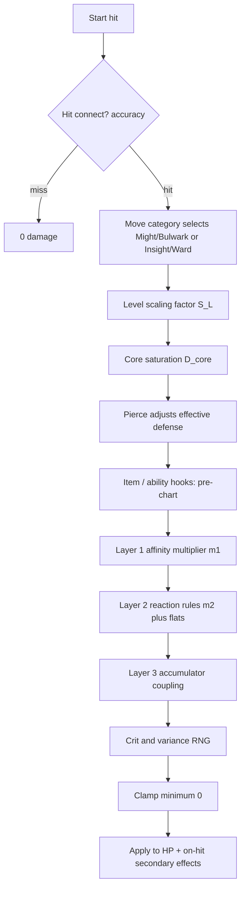

# Wildloom — combat model (attributes, affinities, damage)

**Status:** Specification draft aligned with [`TECHNICAL-DESIGN.md`](./TECHNICAL-DESIGN.md) §4–§6. Implement verbatim in `packages/combat` on both server and client preview.

**Goals:** Server-authoritative, deterministic given RNG inputs; readable “simple view” (chart + stats); optional depth from **material traits** and **field scalars**; no duplicated formulas across tiers.

---

## 1. Terminology

| Term | Meaning |
|------|--------|
| **Affinity** | Primary combat element on a creature or move (discrete enum). |
| **Tags** | Extra labels on a move (`contact`, `thermal`, `crystalline`, …) used by reaction rules—not necessarily tied to affinity. |
| **Material profile** | Normalized latent attributes on a creature used only by Layers 2–3 (not the beginner chart). |
| **Layer 1** | Classic effectiveness multipliers from affinity matchup. |
| **Layer 2** | Data-driven predicate rules (physics-flavored hooks). |
| **Layer 3** | Continuous accumulators (fracture, corrosion, heat load) updated each tick/subtick. |

Affinity names in examples below are **placeholders** (`Solar`, `Tidal`, `Mineral`, …). Ship with an original chart.

---

## 2. Creature attributes

### 2.1 Core stats (six-tuple)

Used everywhere in damage, speed order, and HP.

| Id | Role | Notes |
|----|------|--------|
| `vitality` | HP capacity | Current HP is battle state; max derives from vitality + level/budget. |
| `might` | Physical offense | Used by **strike** moves. |
| `bulwark` | Physical mitigation | Reduces strike damage (with saturation). |
| `insight` | Special offense | Used by **surge** moves. |
| `ward` | Special mitigation | Reduces surge damage. |
| `tempo` | Speed / initiative | Turn order; optional accuracy/evasion hooks. |

**Derived convenience (optional, recomputed each battle tick):**

- `effective_might = might * product(modifiers)`
- Same pattern for other stats—buffs apply as multiplicative or additive stacks with declared precedence (see §8).

### 2.2 Material profile (latent vector)

Per creature (species base ± small training/item deltas). Components are **roughly in [0, 1]** after normalization.

| Component | Meaning (design) |
|-----------|------------------|
| `thermal_mass` | Absorbs heat slowly vs flashes hot/cold. |
| `conductivity` | Lets charge/heat spread (pairs with wetness). |
| `rigidity` | Brittle vs flexible (high → thermal shock / shatter hooks). |
| `porosity` | Holds moisture, corrodes, wicks. |
| `polarity` | Charge buildup / discharge interactions. |

**Rule:** Material profile **does not** replace core stats; it keys **Layer 2–3** only. New players can ignore it until inspect/advanced UI.

### 2.3 Identity flags (combat-relevant)

- `primary_affinity`, optional `secondary_affinity` (secondary typically weaker STAB—**Open decision**: half STAB vs chart-only).
- `species_tags` optional defaults for rules (e.g. many Mineral species tag `crystalline_body`).

---

## 3. Moves

Each move carries:

| Field | Purpose |
|-------|---------|
| `category` | `strike` \| `surge` \| `true` |
| `base_power` | Non-negative scalar; can be 0 for utility. |
| `affinity` | Chart element for Layer 1 / STAB. |
| `tags` | Set of strings for predicates (`thermal`, `aqueous`, `contact`, …). |
| `pierce` | Fraction in `[0, 1]` — ignores part of opposing defense category (§5.2). |
| `damage_kind` | Usually `hp`; some moves only tick accumulators or apply disables. |

**True damage:** Skips **saturation path using bulwark/ward** but may still be altered by global shields or scripted absorbs—declare explicitly per effect.

---

## 4. Battle context (what the resolver reads)

Immutable snapshot per resolution step (plus RNG stream):

- Attacker/defender **stats effective** after temporary buffs.
- **Level** `L_a`, `L_d` (for scaling guardrails).
- **Affinity** IDs.
- **Material** vectors `M_a`, `M_d`.
- **Field scalars:** `ambient_temp`, `humidity`, `terrain_id`, etc.
- **Per-combatant scalars:** `wetness`, `heat_load`, `fracture`, `corrosion`, `charge_buildup` (Layer 3 accumulators).
- Move **tags** and **category**.

---

## 5. Damage pipeline (single hit)

Execute steps **in order**; each step consumes labeled modifiers so audits and replays stay readable.



### 5.1 Hit resolution (optional but recommended)

Binary or phased—your choice—as long as RNG is seeded:

```
p_hit = clamp01( p_base * acc_factor(attacker) / ev_factor(defender) )
```

If miss: emit `miss` event; no on-hit reactions.

### 5.2 Effective defense and pierce

For strike:

```
Def_eff = bulwark_eff * (1 - pierce_move * λ_p)
```

For surge: use `ward_eff` likewise. `λ_p` is a global tuning constant (e.g. `1` means “pierce is literal fraction ignored”).

### 5.3 Level scaling `S_L`

Prevents low-level stat dumps from breaking at extreme levels; data-driven:

```
S_L = (c0 + c1 * L_a) / (c2 + c3 * L_d)
```

Coefficients live in balance JSON. Alternative: match classic curves for `L ≤ 100` only—same piecewise policy as progression doc.

### 5.4 Core saturation (`D_core`)

**Design intent:** Damage rises with offense but **asymptotes** against defense—no endless linear “+1 Atk = +k damage.”

Let:

- `A` = effective offense stat (`might_eff` or `insight_eff`).
- `D` = effective defense (`Def_eff` from §5.2).

```
x = max(A / ε, ε)     -- ε tiny constant
y = D / x
sigma = 1 - exp(-κ * (1 / (1 + y)))     -- bounded (0,1) style saturation
-- alternate simpler rational form:
-- sigma = A / (A + λ * D)

D_core = F_scale * move_power_modified * sigma * S_L
```

`F_scale` is global tuning; `move_power_modified` includes staged modifiers (items, abilities **before** chart).

**Properties:**

- Raising `D` reduces `sigma` smoothly.
- Raising `A` increases `sigma` with diminishing returns vs large `D`.

### 5.5 Layer 1 — affinity multiplier `m1`

Table lookup:

```
m1 = CHART[move_affinity][defender_primary]
```

If defender has secondary affinity, optional blend:

```
m1 *= blend(CHART[move][def_ secondary], η)     -- η ∈ [0, 0.5] typical
```

Clamp `m1` to designer bounds `[m_min, m_max]` to stop explosiveness.

**STAB (same-affinity bonus):**

```
if move_affinity ∈ {attacker_primary, attacker_secondary}:
  m1 *= stab_bonus          -- e.g. 1.15 primary, 1.08 secondary
```

### 5.6 Layer 2 — predicate rules

Rules are **ordered** by `priority` (stable sort). Each rule has:

- `when`: boolean expression over tags, affinities, materials, scalars.
- `then`: structured ops (multiply, add flat, schedule DoT, bump accumulator).

**Evaluation:**

```
m2 = 1
flat2 = 0
for rule in rules_sorted:
  if rule.when(ctx):
    m2 *= rule.mult ?? 1
    flat2 += rule.add ?? 0
    apply side effects (push fracture delta, etc.)

D_after_chart = D_core * m1 * m2 + flat2
```

**Example predicates** (illustrative):

- `tag(move, thermal) AND M_d.rigidity > 0.65 AND wetness_d > 0.25` → `mult *= 1.25`, `fracture += Δ`.

Use short-circuit evaluation; cap rule count per hit for CPU bounds.

### 5.7 Layer 3 — accumulator coupling

Accumulators `u ∈ ℝ^n` evolve continuously or per sub-tick:

```
Δu = h(move, tags, M_a, M_d, ambient)   -- may be zero for this hit
u ← clamp(u + Δu, u_min, u_max)
```

Damage coupling examples:

```
fracture exposes defense: bulwark_eff *= (1 - γ * tanh(fracture))
heat_load triggers overload moves or disables regeneration
```

Apply **after** `D_after_chart` or split between pre/post depending on effect—**must be consistent per rule id** (document in rule schema).

### 5.8 Crit and variance

Prefer **bounded variance** over spike RNG:

```
crit_mult = 1 + bernoulli(p_crit) * (crit_bonus - 1)     -- seeded RNG
spread = uniform_in_[−δ, +δ]                               -- small δ e.g. 0.03

D_final_raw = D_after_chart * crit_mult * (1 + spread)
```

### 5.9 Final application

```
damage_hp = max(0, floor(D_final_raw))
HP_d ← HP_d - damage_hp
emit HitResolved { damage_hp, breakdown }    -- breakdown for UI/log/replay
```

`breakdown` records each multiplier for debugging competitive disputes.

---

## 6. Damage over time & coupled flows

DoTs are **not** re-run through full strike/surge chart unless rule says so.

```
dHP_dt = −Σ_k potency_k(u) + recovery_terms
Δu_k = f_k(u, resistances)
```

Integrate with fixed substeps (e.g. 1/10 turn) for determinism. **Stacks** merge via defined policy (`max stacks`, `refresh duration`, `harmonic sum`).

---

## 7. Multi-hit moves

For hits `i = 1..H`:

- Compute exposure scalar `E` (starts at base, grows per hit):  
  `E_{i+1} = E_i + Δ_exposure(hit_i, defender posture)`
- Optional: `damage_i *= (1 + η * tanh(E_i))`

Total damage is sum of hits; each hit runs §5 with shared RNG stream advancement.

---

## 8. Modifier stacking policy (must be explicit)

Declare globally:

1. **Multiplicative buckets:** `item`, `terrain`, `ability`, `volatile` — multiply within bucket, then multiply buckets in fixed order.
2. **Additive bonuses** to stat ratios (e.g. `+10% might`) convert to multiplier `(1 + Σ adds)` inside one bucket.
3. **Caps:** per-bucket and global—prevents runaway preview bugs.

Document in schema so tools can simulate.

---

## 9. Data artifacts (implementation checklist)

| Artifact | Role |
|----------|------|
| `affinities.json` | Enum order + display strings + icon keys. |
| `affinity_chart.json` | Matrix `[attack][defend] → multiplier`. |
| `reaction_rules/*.yaml` | Predicate AST + effects + priority. |
| `material_axes.json` | Names, defaults per species, normalization bounds. |
| `scaling_curves.json` | `S_L`, saturation `κ`, `λ`, pierce `λ_p`. |
| `moves.json` | Fields in §3 + versioning hash per patch. |

Version every artifact; bake hash into replay header.

---

## 10. Accessibility vs depth

- **Beginner UI:** Shows Layer 1 multiplier only + damage category (strike/surge).
- **Intermediate:** Surfaces tags icons when they triggered a rule (“Thermal shock!”).
- **Advanced inspect:** Full breakdown JSON, material bars, accumulator trajectories.

Formal STEM knowledge is **never** required—copy ties metaphors to observable meters.

---

## 11. Open tuning knobs

Document chosen defaults after first Monte Carlo pass:

- Saturation shape (`exp` vs rational).
- Chart bounds `m_min`, `m_max`.
- Secondary affinity contribution η.
- Whether **true** bypasses Layer 2 (usually yes for simplicity; rare exceptions via rule flags).

---

## Document changelog

| Date | Change |
|------|--------|
| 2026-05-03 | Initial combat integration spec |
