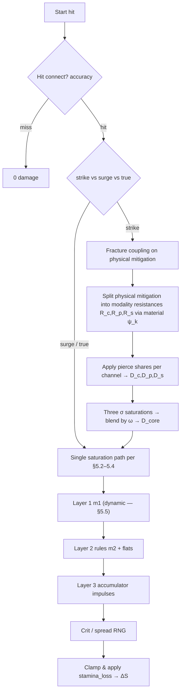

# Wildloom — combat model (attributes, affinities, endurance)

**Related:** [`PROJECT-BRIEF.md`](./PROJECT-BRIEF.md) — vision. [`GAMEPLAY-SYSTEMS.md`](./GAMEPLAY-SYSTEMS.md) — affinity catalog & example reactions. [`SIMULATION-AND-PEDAGOGY.md`](./SIMULATION-AND-PEDAGOGY.md) — continuous dynamics, stealth physics literacy. [`DESIGN-SUPPLEMENT.md`](./DESIGN-SUPPLEMENT.md) — full 12×12 chart, nine stats, statuses, stances, expanded artifacts. [`ATTACK-CATALOG.md`](./ATTACK-CATALOG.md) — composable attack templates & player slots. Code: [`packages/combat`](../packages/combat/README.md).

**Status:** Specification draft aligned with [`TECHNICAL-DESIGN.md`](./TECHNICAL-DESIGN.md) §4–§6. Server-authoritative, deterministic given RNG inputs; readable “simple view” (collapsed matchup chip + stats); optional depth from **material traits**, **field scalars**, and **continuous Layer 1 shaping**; no duplicated formulas across tiers.

**Design principle:** Fights are modeled **calculus-forward**: discrete actions inject **impulses** into continuous state, and **damage-over-time** channels are explicit \(\mathrm{d}S/\mathrm{d}t\) terms—not afterthoughts. The primary battle pool is **current endurance** \(S(t)\), capped by **`stamina`** (schema id for **endurance capacity** — rolled aptitude + training). When \(S \le 0\), the combatant is **incapacitated** (unable to continue)—the usual JRPG “HP bar” is deliberately avoided as the core metaphor; narration can still imply lethal outcomes without centering “fatality” as a separate meter.

---

## 1. Terminology

| Term | Meaning |
|------|--------|
| **Affinity** | Primary combat element on a creature or move (discrete enum). |
| **Tags** | Extra labels on a move (`contact`, `thermal`, `crystalline`, …) used by reaction rules—not necessarily tied to affinity. |
| **Material profile** | Normalized latent attributes on a creature used only by Layers 2–3 (not the beginner chart). |
| **Layer 1** | Matchup multiplier \(m_1\) — **continuous function** of baseline tendencies plus attacker/defender stats, materials, affinity emphasis, move composition, and field (**bounded**, often \(\approx [0,2]\)); collapsed table view optional for onboarding ([§5.5](#55-layer-1--affinity-multiplier-m1)). |
| **Layer 2** | Data-driven predicate rules (physics-flavored hooks). |
| **Layer 3** | Continuous accumulators (fracture, corrosion, heat load) updated each tick/subtick. |
| **Strike modality** | How a **strike** splits across **concussive / piercing / slashing** channels (physics-flavored wound mechanics). Distinct from move-field **`pierce`** (numeric armor bypass). |
| **`stamina`** | Schema id for **endurance capacity**: maximum **endurance pool** (rolled aptitude + training)—how long the creature can sustain effort before collapse. |
| **Current endurance** \(S(t)\) | Battle state scalar depleted by hits and continuous drains; UI may label “readiness” / “fight stamina.” Not “hit points” as a metaphor. |
| **Incapacitated** | \(S \le 0\) — combat loss condition (collapse / exhaustion); switches and XP behave like a knockout. |

Affinity IDs in **content data**: **twelve-ID** roster in [`GAMEPLAY-SYSTEMS.md`](./GAMEPLAY-SYSTEMS.md) §1; MVP resolver enums may ship **nine** first. Authoritative 12×12 **`CHART₀`** lives in [`DESIGN-SUPPLEMENT.md`](./DESIGN-SUPPLEMENT.md) §2. Older examples may say “Solar/Tidal”—swap at authoring time.

---

## 2. Creature attributes

### 2.1 Core combat stats (six-stat core — resolver)

Used everywhere in damage coupling, **initiative** order, and **endurance pool** sizing. **Schema ids** below match [`packages/combat`](../packages/combat/src/types.ts) (`CoreStats`). Player-facing copy should use the **name** column; extended stats (**precision**, **recovery**, **coupling**) live in [`DESIGN-SUPPLEMENT.md`](./DESIGN-SUPPLEMENT.md) §3.

| Schema id | Name (player-facing) | Role | Notes |
|-----------|----------------------|------|--------|
| `stamina` | **Endurance capacity** | Pool ceiling \(S_{\max}\) | Current endurance \(S\) is battle state (\(0 \le S \le S_{\max}\)). **Instance** rolled aptitude + level budget **`B(L)`** + training derive \(S_{\max}\) — not a species lookup ([`TECHNICAL-DESIGN.md`](./TECHNICAL-DESIGN.md) §5). |
| `physical_offense` | **Physical offense** | Strike scaling | Used by **strike** moves in saturation vs **`physical_mitigation`**. |
| `physical_mitigation` | **Physical mitigation** | Strike defense | Reduces strike **endurance loss** (with saturation); fracture/posture may reshape effective mitigation (§5.7). |
| `special_offense` | **Special offense** | Surge scaling | Used by **surge** moves — field / non-contact potency (energy-amplitude metaphor). |
| `special_mitigation` | **Special mitigation** | Surge defense | Reduces surge **endurance loss** (with saturation). |
| `initiative` | **Initiative** | Speed / turn order | Turn order; optional accuracy/evasion hooks. |

**Derived convenience (optional, recomputed each battle tick):**

- `effective_physical_offense = physical_offense * product(modifiers)`
- Same pattern for other stats—buffs apply as multiplicative or additive stacks with declared precedence (see §8).

### 2.2 Material profile (latent vector)

**Distribution intent:** Each **instance** rolls the full twelve-axis vector from **global/stage/encounter** priors ([`GAMEPLAY-SYSTEMS.md`](./GAMEPLAY-SYSTEMS.md) §4). Species catalog rows **do not** fix material means—dex entries are flavor-only ([`TECHNICAL-DESIGN.md`](./TECHNICAL-DESIGN.md) §1).

Per creature (rolled axes ± temporary battle modifiers). Components are **roughly in [0, 1]** after normalization.

| Component | Meaning (design) |
|-----------|------------------|
| `thermal_mass` | Absorbs heat slowly vs flashes hot/cold. |
| `conductivity` | Lets charge/heat spread (pairs with wetness). |
| `rigidity` | Brittle vs flexible (high → thermal shock / shatter hooks). |
| `porosity` | Holds moisture, corrodes, wicks. |
| `polarity` | Charge buildup / discharge interactions. |

**Twelve-axis target —** [`DESIGN-SUPPLEMENT.md`](./DESIGN-SUPPLEMENT.md) §4 adds `density`, `elasticity`, `reflectivity`, `acoustic_impedance`, `chemical_reactivity`, `magnetization`, `permeability` (all rolled per instance).

**Rule:** Material profile **does not** replace core stats; it keys **Layer 2–3** and contributes terms to **dynamic Layer 1** (§5.5). New players can ignore it until inspect/advanced UI.

### 2.3 Identity flags (combat-relevant)

- **`affinity_emphasis`** (required on instances): vector or normalized weights over affinity IDs—implements **composed typings**. Catalog `primary_affinity` / `secondary_affinity` / `affinity_emphasis_hint` are **non-authoritative** dex seeds; combat MUST use the instance’s rolled emphasis ([`GAMEPLAY-SYSTEMS.md`](./GAMEPLAY-SYSTEMS.md) §1.2).
- **`species_tags`** optional defaults for rules (e.g. `crystalline_body`).
- Pass emphasis vectors + materials into **`m1`**; static charts alone are insufficient for target dynamism (§5.5).

---

## 3. Moves

Each move carries:

| Field | Purpose |
|-------|---------|
| `category` | `strike` \| `surge` \| `true` |
| `base_power` | Non-negative scalar; can be 0 for utility. |
| `affinity` | Optional chart key for Layer 1 / stab hooks — **omit or null** for non-elemental builds (neutral baseline multiplier until emphasis/`affinity_weights` fully reshape §5.5). |
| `affinity_weights` | Optional simplex over affinity IDs (sums to `1`) — **Luminous–Mineral Blast** style fusion; feeds §5.5 with `affinity`. |
| `template_id` | Optional frame (`blast`, `lash`, …) for authoring pipelines, tutorials, and combo detection. |
| `infusion_coeffs` | Optional bag of **continuous** tuning knobs (e.g. tag intensity, modality tilt, pierce bias)—serialized for replay; bounded per move family. |
| `tags` | Set of strings for predicates (`thermal`, `aqueous`, `contact`, …). |
| `pierce` | Fraction in `[0, 1]` — geometric / armor bypass applied **per modality** (§5.4b); strongest on the **piercing** channel by default. |
| `strike_modalities` | Optional ω simplex on **strike** moves (`delivery_modalities` absent); omit ⇒ blunt-only legacy path. |
| `delivery_modalities` | Same ω shape on **surge** moves (e.g. Blast) — partitions coupling across concussive / piercing / slashing **delivery** into **`special_mitigation`** with the same material ψ kernels as §5.4b. Resolver prefers `delivery_modalities` when both fields are present. |
| `cooldown_turns` | Integer turns before reuse — hydrate from template **`cooldown_scaling`** × **`base_power`** (stronger customization ⇒ longer wait); consumed by turn scheduler, not `resolveHit`. |
| **`status_payloads`** (planned hydrate) | Optional **`on_hit` / `on_tick` / `self`** status applications — effect id, duration subticks, potency, stacking rule ref, proc chance — **bounded per template** like other sliders ([`GAMEPLAY-SYSTEMS.md`](./GAMEPLAY-SYSTEMS.md) §1.3). |
| **`accumulator_impulses`** (planned hydrate) | Optional structured deltas on Layer 3 keys (`heat_load`, `wetness`, `fracture`, …) triggered on hit / crit / channel tick — same accumulator vocabulary creatures use ([`GAMEPLAY-SYSTEMS.md`](./GAMEPLAY-SYSTEMS.md) §2.1). |
| **`passive_hooks`** (planned hydrate) | Optional slot-bound **passive affinity emphasis**, aura ticks, or stance coupling — player selects within authored simplex / intensity bands; mirrors passive-ish creature traits without duplicating math. |
| `damage_kind` | Usually `endurance` (depletes \(S\)); some moves only tick accumulators or apply disables (`status`, `utility`). |

**True damage:** Skips **saturation path using `physical_mitigation` / `special_mitigation`** but may still be altered by global shields or scripted absorbs—declare explicitly per effect.

**Compositional moves:** Players and designers assemble **display names** from template + infusions (“Void Blast”, “Floral Surge”, …). Mechanics depend on **`affinity_weights`**, **`infusion_coeffs`**, and stats—not on the display string alone.

**Naming:** **`pierce` (field)** = scalar bypass knob on data. **“Piercing” modality** = localized stress concentration / stab geometry feeding its **own** saturation branch—do not conflate the two in authoring tools.

---

## 4. Battle context (what the resolver reads)

Immutable snapshot per resolution step (plus RNG stream):

- Attacker/defender **stats effective** after temporary buffs.
- **Level** `L_a`, `L_d` (for scaling guardrails).
- **Affinity emphasis** vectors (and optional primary/secondary summaries).
- **Material** vectors `M_a`, `M_d`.
- **Field scalars:** `ambient_temp`, `humidity`, `terrain_id`, etc.
- **Per-combatant scalars:** `wetness`, `heat_load`, `fracture`, `corrosion`, `charge_buildup` (Layer 3 accumulators).
- **Active statuses** from terrain, abilities, items — predicates read **`volatile`** / **`status`** bags ([`DESIGN-SUPPLEMENT.md`](./DESIGN-SUPPLEMENT.md) statuses).
- Move **tags** and **category**.

---

## 5. Damage pipeline (single hit)

### 5.0 Mathematical substrate — physics, calculus, and probability

The resolver does **not** aim to be a spreadsheet of unrelated percentages. Each hit is one **sample** drawn from a model whose **definitions** are calculus- and physics-shaped:

1. **Hybrid dynamical system (endurance):** Between discrete actions, endurance \(S(t)\) obeys smooth flows from recovery and DoT channels ([§6](#6-damage-over-time--coupled-flows)):
   \[
   \frac{\mathrm{d}S}{\mathrm{d}t} = -\sum_k \mathrm{potency}_k(\mathbf{u}(t)) + r(S,\mathbf{u}),\qquad
   \frac{\mathrm{d}\mathbf{u}}{\mathrm{d}t} = \mathbf{g}(\mathbf{u}, \text{field}, \ldots).
   \]
   A resolved hit applies a **downward jump** \(\Delta S\) at a subtick boundary — a **piecewise-smooth / jump** process, not a lone subtraction isolated from \(\mathbf{u}\).

2. **Nonlinear constitutive map (saturation):** For strike/surge cores, the scalar \(\sigma(A,D)\in(0,1)\) in §5.4 is a **smooth response function** (stress–strain / transfer-efficiency metaphor): raising offense \(A\) increases \(\sigma\) with **diminishing returns** against fixed mitigation \(D\); raising \(D\) lowers \(\sigma\) smoothly. Balance tools treat \(\partial \sigma/\partial A\) and \(\partial \sigma/\partial D\) (numerically or in closed form where authored) as **local elasticities** — see [`SIMULATION-AND-PEDAGOGY.md`](./SIMULATION-AND-PEDAGOGY.md) §7.

3. **Multi-channel strikes and surges as parallel pathways:** §5.4b is a **partition of coupling effort** \(\boldsymbol{\omega}\) across concussive / piercing / slashing branches (strikes on **`physical_mitigation`**, surges on **`special_mitigation`**). Each branch has its own resistance \(R_k = B_{\mathrm{eff}}\psi_k(\mathbf{M})\) — material fields \(\psi_k\) play the role of **geometry- and phase-dependent impedances**. The blended core is \(D_{\mathrm{core}}=\sum_k \omega_k D_{\mathrm{core},k}\): additive in **energy partitioned pathways**, each nonlinear in its own \(D_k\).

4. **Probability layer (hit, crit, spread):** Let \(H\in\{0,1\}\) be hit/miss with \(\mathbb{P}(H{=}1)=p_{\mathrm{hit}}\) (§5.1). Conditional on \(H{=}1\), define multiplicative noise \(X = C\cdot \Xi\) where \(C\) is crit multiplier (Bernoulli / mixed distribution from data) and \(\Xi = 1+U\) with \(U\) symmetric on \([-\delta,\delta]\) (§5.8). With **independence** \(C \perp \Xi\),
   \[
   \mathbb{E}[\Delta S \mid H{=}1] \approx \mathbb{E}[D_{\mathrm{after}}]\,\mathbb{E}[C]\,\mathbb{E}[\Xi]
   \]
   before integer rounding — and \(\mathbb{E}[\Xi]=1\) for symmetric \(U\). The shipped **`resolveHit`** consumes one RNG stream outcome per hit: that is a **Monte Carlo draw** from this law; UX “expected damage” previews may show \(\mathbb{E}[\cdot]\) while logs retain the sample ([§5.8](#58-crit-and-variance) elaborates).

5. **Layer 1 `m1` as deterministic field map:** \(m_1\) is a **smooth bounded functional** of emphasis vectors, materials, and field scalars (§5.5) — no RNG unless explicitly opted-in. It acts like a **position-dependent modifier** in a continuum-style matchup field, not a second arithmetic fudge isolated from physics metaphor.

6. **Discrete evaluator:** The ordered steps in §5.1–5.9 are a **single-hit evaluator** that samples \(H,C,U\) and evaluates \(\sigma\), \(\psi_k\), and \(m_1\) at the current \(\mathbf{u}\) snapshot. Full-turn combat integrates \(\mathrm{d}S/\mathrm{d}t\) between hits on a subtick lattice ([§6.2](#62-integration-policy)).

Optional **hit probability** beyond flat `accuracy/100`: author a **logistic link** on latent aim vs evasion (precision / initiative flavored),
\[
p_{\mathrm{hit}} = \mathrm{clamp}_{[0,1]}\Bigl(\bigl(1+\exp(-(\alpha + \boldsymbol{\beta}\cdot\mathbf{z}))\bigr)^{-1}\Bigr),
\]
with \(\mathbf{z}\) featuring attacker **`precision`**, defender evasion proxy, range, and stance — coefficients live in balance JSON.

---

Execute steps **in order**; each step consumes labeled modifiers so audits and replays stay readable.



### 5.1 Hit resolution (probability contract)

Each attempt draws \(U \sim \mathrm{Uniform}(0,1)\) (seeded stream). One portable formulation:

\[
H = \mathbb{1}\{ U < p_{\mathrm{hit}} \},\qquad
p_{\mathrm{hit}} = \mathrm{clamp}_{[0,1]}\bigl(\sigma_{\mathrm{acc}}(\texttt{precision}_a,\texttt{initiative}_d,\ldots)\bigr).
\]

**Baseline stub:** `p_hit = accuracy / 100` when only a scalar is authored.

**Physics-shaped upgrade:** \(\sigma_{\mathrm{acc}}\) is a **sigmoid / logistic** (see §5.0 optional link) so marginal gains in **`precision`** change hit odds smoothly — no threshold cliffs unless a Layer 2 rule intentionally introduces one.

If \(H{=}0\): emit `miss`; no on-hit reactions; \(\Delta S = 0\) for this impulse.

If \(H{=}1\): proceed — conditional distribution of downstream noise is §5.8.

### 5.2 Effective defense and pierce

For **surge** (and single-path strike fallback):

```
-- Strike → saturate vs physical_mitigation; surge → vs special_mitigation (after pierce trim)
Def_eff ← relevant_defense_eff * (1 - pierce_move * λ_p)    -- scalar bypass
```

For **strike / surge modality blend** (§5.4b), the same `pierce_move` scalar is applied **after** splitting resistances, with **channel-specific weights** \(\lambda_{\mathrm{con}}, \lambda_{\mathrm{pier}}, \lambda_{\mathrm{slas}}\) (usually \(\lambda_{\mathrm{pier}} \approx 1\), smaller shares on blunt/slash—data-tuned).

`λ_p` is a global tuning constant (e.g. `1` means “pierce ignores that fraction of **that channel’s** resistance before saturation”).

### 5.3 Level scaling `S_L`

Prevents low-level stat dumps from breaking at extreme levels; data-driven:

```
S_L = (c0 + c1 * L_a) / (c2 + c3 * L_d)
```

Coefficients live in balance JSON. Alternative: match classic curves for `L ≤ 100` only—same piecewise policy as progression doc.

### 5.4 Core saturation (`D_core`)

**Design intent:** Damage rises with offense but **asymptotes** against defense—no endless linear “+1 Atk = +k damage.”

Let:

- `A` = effective offense stat (`physical_offense_eff` or `special_offense_eff`).
- `D` = effective defense (`Def_eff` from §5.2).

```
x = max(A / ε, ε)     -- ε tiny constant
y = D / x
sigma = 1 - exp(-κ * (1 / (1 + y)))     -- bounded (0,1) style saturation
-- alternate simpler rational form:
-- sigma = A / (A + λ * D)

D_core = F_scale * move_power_modified * sigma * S_L
```

`F_scale` is global tuning; `move_power_modified` includes staged modifiers (items, abilities **before** chart).

**Properties:**

- Raising `D` reduces `sigma` smoothly.
- Raising `A` increases `sigma` with diminishing returns vs large `D`.

### 5.4b Delivery modality blend — concussive, piercing, slashing (strike & surge)

**Intent:** A move can carry a mixture of **impulse** (concussive), **localized penetration** (piercing modality), and **shear / cutting** (slashing). **Strikes** partition **`physical_mitigation`**; **surges** (e.g. Blast) use the **same ω machinery** against **`special_mitigation`** so players can shape “beam vs shear vs blunt pulse” without a second math system. Each channel gets its own smooth saturation against a **material-shaped** resistance before blending.

**Surge vs strike:** Let \(B_{\mathrm{eff}}\) be defender **effective mitigation** for the path in use — **`physical_mitigation`** (post-fracture hooks for strikes, §5.7) or **`special_mitigation`** (surge). The same \(\psi_k(\mathbf{M})\) impedance story applies to \(R_k = B_{\mathrm{eff}}\cdot \psi_k(\mathbf{M})\).

**Resistance shaping (examples — ship ψ from `scaling_curves.json`):**

\[
R_{\mathrm{con}} = B_{\mathrm{eff}}\cdot \psi_{\mathrm{con}}(\mathbf{M}),\quad
R_{\mathrm{pier}} = B_{\mathrm{eff}}\cdot \psi_{\mathrm{pier}}(\mathbf{M}),\quad
R_{\mathrm{slas}} = B_{\mathrm{eff}}\cdot \psi_{\mathrm{slas}}(\mathbf{M})
\]

Toy interpretations (not literal FEM):

- **Concussive:** blunt impulse transmission vs damping — \(\psi_{\mathrm{con}}\) rises when rigid shells **transmit shock** into the body (high `rigidity`), drops when compliant layers dissipate (coordination with porosity / species tags).
- **Piercing modality:** stress concentration against hardness / laminate ordering — \(\psi_{\mathrm{pier}}\) grows with `rigidity` (harder to punch through) unless fracture has softened the face (couple §5.7).
- **Slashing:** surface shear + tearing — \(\psi_{\mathrm{slas}}\) mixes `rigidity` (cut resistance) with `porosity`/wetness hooks for **laceration** routes (Layer 3).

**Per-channel pierce & saturation:**

\[
D_k = R_k\cdot\bigl(1 - \mathrm{pierce}_{\mathrm{move}}\cdot \lambda_k\cdot \lambda_p\bigr),\quad k\in\{\mathrm{con},\mathrm{pier},\mathrm{slas}\}
\]

\[
\sigma_k = 1 - \exp\!\left(-\kappa \cdot \frac{1}{1 + D_k / x}\right),\quad
D_{\mathrm{core},k} = F_{\mathrm{scale}}\cdot P\cdot \sigma_k\cdot S_L
\]

**Simplex blend** \(\boldsymbol{\omega}=(\omega_c,\omega_p,\omega_s)\), \(\sum\omega = 1\):

\[
D_{\mathrm{core}} = \omega_c D_{\mathrm{core},\mathrm{con}} + \omega_p D_{\mathrm{core},\mathrm{pier}} + \omega_s D_{\mathrm{core},\mathrm{slas}}
\]

**Audit / replay:** store \(\boldsymbol{\omega}\), each \(\sigma_k\), and \(D_{\mathrm{core},k}\) in `HitResolved.breakdown.modalities` for competitive disputes—see [`packages/combat`](../packages/combat/README.md).

**Layer 3 impulses:** concussive fraction feeds **`concussion`** accumulation (initiative / **precision** coupling — [`SIMULATION-AND-PEDAGOGY.md`](./SIMULATION-AND-PEDAGOGY.md) §3.5); slashing feeds **`laceration`** bleed drivers §3.6; piercing modality spikes **`fracture`** when paired with rigid ceramics—author specific impulses in Layer 2 rules to avoid double-counting.

### 5.5 Layer 1 — affinity multiplier `m1` (dynamic, bounded)

**Goal:** “Super effective” is **not** a single baked scalar per cell. A **baseline chart** \(C_{a,d}\in\mathbb{R}^+\) (authoring prior — often near prior supplements’ \(0.5\ldots 2\) culture) is **continuously reshaped** by attacker/defender **stats**, **material profiles**, **`affinity_emphasis` vectors**, **move `affinity_weights` / infusions**, and **field scalars** so two different creatures in the “same” matchup can land at **different** \(m_1\). Typical shipped band: **`m_min` … `m_max`** with **`m_max ≈ 2`** and **`m_min` down to `0`** when tuning demands hard resist—exact floors are balance-owned.

**Sketch (implement as pure function + tests):**

```
-- Baseline tendency from pairwise physics metaphor table (optional tensor + legacy dual blend)
B = blend_chart(move_side, defender_side, η)        -- e.g. dual emphasis replaces single primary key

-- Creature-specific alignment / resistance (smooth — prefer tanh/sigmoid, not step hacks)
A_att = dot(normalize(attacker.affinity_emphasis), affinity_axis(move))   -- or kernel(move.affinity_weights)
R_def = resist_kernel(defender.stats_eff, defender.materials, move.affinity, move.tags, field)

-- Example multiplicative shaping (illustrative coefficients κ₁, κ₂ from JSON)
m1_raw = B * exp( κ1 * tanh(A_att) ) * exp( -κ2 * tanh(R_def) ) * infusion_gate(move.infusion_coeffs)

m1 = clamp(m_min, m_max, m1_raw)                  -- e.g. m_max = 2.0, m_min = 0.0

-- Optional same-turn STAB / synergy as continuous bonus instead of only discrete ×1.15:
m1 *= stab_factor(attacker.affinity_emphasis, move.affinity, move.affinity_weights)
```

**Requirements:**

- **`m1`** must be **deterministic** given sealed battle snapshot + move instance (no hidden RNG in Layer 1 unless explicitly opted-in and logged).
- **Beginner UI** may display **`round(m1, 2)`** and a color bucket (“weak / neutral / sharp”) while **Analyst** tier shows contributing terms for \(\partial m_1 / \partial\) stats (see [`SIMULATION-AND-PEDAGOGY.md`](./SIMULATION-AND-PEDAGOGY.md) §7 spirit).
- **`packages/combat`** may stub **`lookupAffinityChart`** as constant until the dynamic resolver lands; production **`resolveHit`** consumes the full **`m1`** function output recorded in `HitResolved.breakdown.m1_terms` (**Open decision**: schema detail).

**Legacy note:** Older docs that write `m1 = CHART[a][d]` describe the **baseline only**; they remain useful for balance spreadsheets and AI tutoring, not as the final shipped resolver.

### 5.6 Layer 2 — predicate rules

Rules are **ordered** by `priority` (stable sort). Each rule has:

- `when`: boolean expression over tags, affinities, materials, scalars.
- `then`: structured ops (multiply, add flat, schedule DoT, bump accumulator).

**Evaluation:**

```
m2 = 1
flat2 = 0
for rule in rules_sorted:
  if rule.when(ctx):
    m2 *= rule.mult ?? 1
    flat2 += rule.add ?? 0
    apply side effects (push fracture delta, etc.)

D_after_chart = D_core * m1 * m2 + flat2
```

**Example predicates** (illustrative):

- `tag(move, thermal) AND M_d.rigidity > 0.65 AND wetness_d > 0.25` → `mult *= 1.25`, `fracture += Δ`.

Use short-circuit evaluation; cap rule count per hit for CPU bounds.

### 5.7 Layer 3 — accumulator coupling

Accumulators `u ∈ ℝ^n` evolve continuously or per sub-tick:

```
Δu = h(move, tags, M_a, M_d, ambient)   -- may be zero for this hit
u ← clamp(u + Δu, u_min, u_max)
```

Damage coupling examples:

```
fracture exposes defense: physical_mitigation_eff *= (1 - γ * tanh(fracture))
heat_load triggers overload moves or disables regeneration
```

Apply **after** `D_after_chart` or split between pre/post depending on effect—**must be consistent per rule id** (document in rule schema).

### 5.8 Crit and variance (stochastic decomposition)

Let \(D_{\mathrm{after}} = D_{\mathrm{core}}\,m_1\,m_2 + \texttt{flat2}\) after Layers 1–2 (deterministic given snapshot).

**Crit:** \(C = 1\) w.p. \(1-p_{\mathrm{crit}}\), else \(C = c_{\mathrm{crit}}\) (e.g. `CRIT_BONUS`). Then \(\mathbb{E}[C] = 1 + p_{\mathrm{crit}}(c_{\mathrm{crit}}-1)\).

**Spread:** \(\Xi = 1+U\) with \(U \sim \mathrm{Uniform}[-\delta,\delta]\). Then \(\mathbb{E}[\Xi]=1\), \(\mathrm{Var}(\Xi)=\delta^2/3\).

**Independence:** If \(C\) and \(\Xi\) are independent (default),
\[
\mathbb{E}[D_{\mathrm{final,raw}} \mid \mathrm{hit}] = D_{\mathrm{after}}\,\mathbb{E}[C]\,\mathbb{E}[\Xi]
= D_{\mathrm{after}}\,\bigl(1 + p_{\mathrm{crit}}(c_{\mathrm{crit}}-1)\bigr).
\]

The reference implementation **samples** one \((C,\Xi)\) pair per hit (`packages/combat`). **`floor`** for integer `stamina_loss` breaks \(\mathbb{E}[\lfloor\cdot\rfloor]=\lfloor\mathbb{E}[\cdot]\rfloor\)` — tooling should integrate expectations **before** flooring when comparing builds.

Prefer **bounded variance** over heavy-tailed spikes so outcomes stay interpretable under the same calculus metaphor.

### 5.9 Final application

```
stamina_loss = max(0, floor(D_final_raw))
S_d ← S_d - stamina_loss
emit HitResolved { stamina_loss, breakdown }    -- breakdown for UI/log/replay
```

`breakdown` records each multiplier for debugging competitive disputes; **`modalities`** carries \(\omega_k\) and per-channel cores when §5.4b applies.

---

## 6. Damage over time & coupled flows

DoTs are **first-class \(\mathrm{d}S/\mathrm{d}t\) terms**: they integrate alongside accumulator flows each subtick. They are **not** (unless a rule says otherwise) re-run through the full strike/surge saturation pipeline—their potency functions \(\mathrm{potency}_k(\mathbf{u})\) are authored as smooth rates tied to bleed, burn, neuro-disruption, corrosion, etc.

### 6.1 Coupled state view

Let \(\mathbf{u}\) bundle Layer 3 scalars (`heat_load`, `wetness`, `fracture`, `charge_buildup`, …). Between discrete actions:

\[
\frac{\mathrm{d}S}{\mathrm{d}t} = -\sum_k \mathrm{potency}_k(\mathbf{u}) + \text{recovery},\qquad
\frac{\mathrm{d}\mathbf{u}}{\mathrm{d}t} = \mathbf{g}(\mathbf{u}, \text{field}, \text{materials}, \ldots)
\]

Here \(S\) is **current endurance** (same pool discrete hits shrink via `stamina_loss`). Recovery is usually small or rule-gated so stall-heavy regeneration cannot dominate without investment.

Hits inject **impulses** \(\Delta \mathbf{u}\) and may reshape effective defense before \(\sigma\) is evaluated—ordering must match [`SIMULATION-AND-PEDAGOGY.md`](./SIMULATION-AND-PEDAGOGY.md) §4.

### 6.2 Integration policy

Integrate with **fixed subticks** per turn (e.g. `1/10`) for deterministic replays. \(\int \mathrm{potency}_k \, \mathrm{d}t\) over a turn is the canonical DoT contribution to \(S\). Stack merging uses explicit policies (`max stacks`, duration refresh, harmonic sum). Full toy flows (cooling, wetness exchange, charge leakage) live in the simulation doc—not duplicated here.

---

## 7. Multi-hit moves

For hits `i = 1..H`:

- Compute exposure scalar `E` (starts at base, grows per hit):  
  `E_{i+1} = E_i + Δ_exposure(hit_i, defender posture)`
- Optional: `damage_i *= (1 + η * tanh(E_i))`

Total damage is sum of hits; each hit runs §5 with shared RNG stream advancement. Interpretation as sampling an **exposure integral**—[`SIMULATION-AND-PEDAGOGY.md`](./SIMULATION-AND-PEDAGOGY.md) §6.

---

## 8. Modifier stacking policy (must be explicit)

Declare globally:

1. **Multiplicative buckets:** `item`, `terrain`, `ability`, `volatile` — multiply within bucket, then multiply buckets in fixed order.
2. **Additive bonuses** to stat ratios (e.g. `+10% physical_offense`) convert to multiplier `(1 + Σ adds)` inside one bucket.
3. **Caps:** per-bucket and global—prevents runaway preview bugs.

Document in schema so tools can simulate.

---

## 9. Data artifacts (implementation checklist)

| Artifact | Role |
|----------|------|
| `species/catalog.json` | **100 species lines** — id, zenith name, 3 stages, habitat; **`primary_affinity` / `secondary_affinity` optional or null** (generated catalog omits typing); **identity only** — combat emphasis/stats/materials roll on each **instance** ([`TECHNICAL-DESIGN.md`](./TECHNICAL-DESIGN.md) §1). |
| `species/species.schema.json` | JSON Schema for catalog entries. |
| `affinity_chart.json` | **`CHART₀` baseline** matrix — feeds §5.5; not final `m1` alone. |
| `scaling_curves.json` | `S_L`, saturation `κ`, `λ`, pierce `λ_p`, modality ψ; **plus Layer 1 reshape** (`κ₁`, `κ₂`, `m_min`, `m_max`, `stab_factor`, resist kernels). |
| `moves.json` | Hydrated **instances** from templates — §3 fields including modalities, **`cooldown_turns`**, planned **`status_payloads`** / **`accumulator_impulses`** / **`passive_hooks`**, versioning hash per patch. |
| `data/moves/attack_templates.catalog.json` | **Authoring library** — frames + customization bands; **extend** with status / accumulator / passive slots per [`ATTACK-CATALOG.md`](./ATTACK-CATALOG.md). |
| `status_catalog.json` (planned) | Status definitions — stacking rules, cleanse families, icon ids — consumed by move payloads & terrain. |
| `move_effect_extensions.schema.json` (planned) | JSON Schema sketch for §3 effect payloads — keep aligned with `attack_template.schema.json`. |

Version every artifact; bake hash into replay header.

**Expanded checklist** (twelve affinities, statuses, accumulators, stances, biomes, combo splits): [`DESIGN-SUPPLEMENT.md`](./DESIGN-SUPPLEMENT.md) §15.

---

## 10. Accessibility vs depth

- **Beginner UI:** Endurance bar (friendly copy: “fight stamina” / “readiness”) + Layer 1 multiplier + strike/surge chips; if `strike_modalities` present, compact hammer/blade/stab glyph strip sums to 100%.
- **Intermediate:** Surfaces tags icons when they triggered a rule (“Thermal shock!”).
- **Advanced inspect:** Full breakdown JSON, material bars, accumulator trajectories, optional **§5.4b** per-channel σ / `d_core_k`.

Formal STEM knowledge is **never** required—copy ties metaphors to observable meters.

---

## 11. Open tuning knobs

Document chosen defaults after first Monte Carlo pass:

- Saturation shape (`exp` vs rational).
- Chart bounds `m_min`, `m_max` for **`m1`** and Layer 1 reshape coefficients (`κ₁`, `κ₂`, `stab_factor` curves, resist kernels).
- Secondary affinity contribution η (baseline **`CHART₀`** blend only — full emphasis vectors may supersede).
- Whether **true** bypasses Layer 2 (usually yes for simplicity; rare exceptions via rule flags).

---

## 12. Reference implementation (`packages/combat`)

TypeScript sources mirror this document:

| File | Responsibility |
|------|----------------|
| [`packages/combat/src/types.ts`](../packages/combat/src/types.ts) | Immutable snapshot types (`Combatant`, `Move`, `BattleContext`, `HitResult`). |
| [`packages/combat/src/math.ts`](../packages/combat/src/math.ts) | `TUNING`, scaling, saturation \(\sigma\), modality ψ helpers; **`expectedDamageMeanBeforeFloor`** (§5.8 law of total expectation); **`coreSaturationOffenseLogElasticity`** / **`coreSaturationDefenseLogElasticity`** (§13). |
| [`packages/combat/src/pipeline.ts`](../packages/combat/src/pipeline.ts) | `resolveHit` — strike modality blend (§5.4b) + Layers 1→3; chart/rules stubbed. |

Build: `npm install` at repo root, then `npm run build -w @wildloom/combat`.

**Guarantees:** No hidden globals in math helpers; RNG enters only through `BattleContext.rng` for deterministic replay when the stream is seeded deterministically.

---

## 13. Core saturation mathematics (§5.4 reference)

Let \(A\) be effective offense and \(D\) effective defense (after pierce). Normalize offense away from division hazards:

\[
x = \max\left(\frac{A}{\varepsilon}, \varepsilon\right)
\]

Defense-heavy ratio:

\[
y = \frac{D}{x}
\]

Saturation scalar (bounded smooth response):

\[
\sigma = 1 - \exp\left(-\kappa \cdot \frac{1}{1 + y}\right)
\]

Core damage before chart layers:

\[
D_{\text{core}} = F_{\text{scale}} \cdot P \cdot \sigma \cdot S_L
\]

Where \(P\) is modified move power (pre–Layer 1 modifiers), \(S_L\) is level scaling (§5.3), \(\kappa\) shapes how quickly offense converts through armor, and \(\varepsilon\) avoids singularities.

**Tuning intuition:** raising \(\kappa\) makes mid-armor transitions steeper; \(F_{\text{scale}}\) sets global pace; pierce \(\lambda_p\) trims effective \(D\) before \(y\) is formed.

**Local sensitivity (calculus tools):** Holding \(P,S_L\) fixed, the **log-elasticity** of core damage w.r.t. offense,
\[
\varepsilon_{A} \equiv \frac{A}{D_{\text{core}}}\frac{\partial D_{\text{core}}}{\partial A}
= \frac{A}{\sigma}\frac{\partial \sigma}{\partial A},
\]
measures percent change in \(D_{\text{core}}\) per percent change in \(A\) near a build — approximated numerically in [`packages/combat`](../packages/combat/src/math.ts) (`coreSaturationOffenseLogElasticity`). Mirror definition for \(\varepsilon_{D}\) w.r.t. mitigation (typically \(\varepsilon_{D}<0\); `coreSaturationDefenseLogElasticity`).

## 14. Interactive parameter explorer (devtools)

An external chat proposed an embedded slider widget for \(\kappa\), pierce, stats, and a defense-sweep chart. That artifact is **not** checked into this repo. Equivalent options:

- Add a small internal **React/Vite** dev page under `packages/combat-devtools/` that imports `@wildloom/combat` and plots \(D_{\text{core}}(D)\) with sliders.
- Export a CSV sweep from a Vitest benchmark using the same pure functions.

---

## 15. Calculus-forward modeling (summary)

Layer 1 uses a **smooth, bounded `m1`** tied to **`CHART₀` priors** and creature/move vectors (§5.5); novice UI **collapses** it to readable buckets. **[§5.0](#50-mathematical-substrate--physics-calculus-and-probability)** states the **continuous-time + probability** contract each hit samples. Depth uses **smooth nonlinear maps** and **continuous flows** everywhere else:

- Saturation §13 gives bounded \(\sigma(A,D)\) with diminishing marginal returns vs armor and explicit **log-elasticities** for balance gradients.
- §5.4b adds **three parallel saturation branches** for strike modalities, blended by \(\boldsymbol{\omega}\)—same asymptotics, different material-shaped defenses.
- §6 couples **endurance** \(S\) evolution to \(\mathbf{u}\) via flows + impulses; DoTs are \(\mathrm{d}S/\mathrm{d}t\) channels.
- §7 treats combos as discrete samples along a posture/exposure curve.

**Full formalism** (ODE templates, integration contract, threshold events, honesty bar): [`SIMULATION-AND-PEDAGOGY.md`](./SIMULATION-AND-PEDAGOGY.md).

---

## 16. Local sensitivities for balance tools

Offline, estimate how small parameter moves \(\theta\) (chart entries, \(\kappa\), pierce, relaxation rates) nudge outcomes—finite differences or Monte Carlo on \(\partial J / \partial \theta\). Keeps “complex calculus” in **tooling**, not player-facing quizzes. Details: [`SIMULATION-AND-PEDAGOGY.md`](./SIMULATION-AND-PEDAGOGY.md) §7.

---

## Document changelog

| Date | Change |
|------|--------|
| 2026-05-03 | Initial combat integration spec |
| 2026-05-03 | Linked `packages/combat` implementation; saturation math appendix; devtools note |
| 2026-05-03 | §6 coupled flows; §15–§16; [`SIMULATION-AND-PEDAGOGY.md`](./SIMULATION-AND-PEDAGOGY.md) cross-links |
| 2026-05-03 | **Surge delivery ω + cooldown scaling:** `delivery_modalities` on surge templates; `cooldown_scaling` on all frames; `resolveCooldownTurnsFromPower` + surge path uses §5.4b blend on **`special_mitigation`** ([`ATTACK-CATALOG.md`](./ATTACK-CATALOG.md)). |
| 2026-05-03 | Related [`DESIGN-SUPPLEMENT.md`](./DESIGN-SUPPLEMENT.md); §9 pointer to expanded artifact list |
| 2026-05-03 | **Endurance-first model:** `vitality` → **`stamina`**; battle pool \(S(t)\); DoTs as explicit \(\mathrm{d}S/\mathrm{d}t\); `damage_kind` / resolver field names aligned with [`packages/combat`](../packages/combat/README.md) (`endurance`, `stamina_loss`). |
| 2026-05-03 | **Procedural / compositional design:** emphasis vectors, fused moves (`affinity_weights`, `infusion_coeffs`), dynamic **`m1`** (§5.5) with **`CHART₀`** baseline; **materials/stats roll per instance** (§2.2), not per catalog row ([`TECHNICAL-DESIGN.md`](./TECHNICAL-DESIGN.md) §1). |
| 2026-05-03 | **Species lines & move frames:** catalog species default **`null`** typing; moves authored only as [`attack_templates.catalog.json`](../data/moves/attack_templates.catalog.json) (removed flat abilities roster); **`Move.affinity`** optional ([`ATTACK-CATALOG.md`](./ATTACK-CATALOG.md)). |
| 2026-05-03 | §3 / §4 / §9: documented planned **`status_payloads`**, **`accumulator_impulses`**, **`passive_hooks`** on moves; volatile/status bags in §4 context; artifact rows for `status_catalog` + effect schema — aligned with [`ATTACK-CATALOG.md`](./ATTACK-CATALOG.md) status/accumulator/passive section and [`GAMEPLAY-SYSTEMS.md`](./GAMEPLAY-SYSTEMS.md) §1.3. |