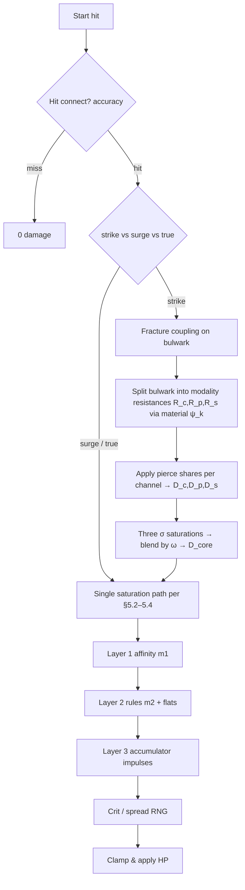

# Wildloom — combat model (attributes, affinities, damage)

**Related:** [`PROJECT-BRIEF.md`](./PROJECT-BRIEF.md) — vision. [`GAMEPLAY-SYSTEMS.md`](./GAMEPLAY-SYSTEMS.md) — affinity catalog & example reactions. [`SIMULATION-AND-PEDAGOGY.md`](./SIMULATION-AND-PEDAGOGY.md) — continuous dynamics, stealth physics literacy. [`DESIGN-SUPPLEMENT.md`](./DESIGN-SUPPLEMENT.md) — full 12×12 chart, nine stats, statuses, stances, expanded artifacts. Code: [`packages/combat`](../packages/combat/README.md).

**Status:** Specification draft aligned with [`TECHNICAL-DESIGN.md`](./TECHNICAL-DESIGN.md) §4–§6. Server-authoritative, deterministic given RNG inputs; readable “simple view” (chart + stats); optional depth from **material traits** and **field scalars**; no duplicated formulas across tiers.

---

## 1. Terminology

| Term | Meaning |
|------|--------|
| **Affinity** | Primary combat element on a creature or move (discrete enum). |
| **Tags** | Extra labels on a move (`contact`, `thermal`, `crystalline`, …) used by reaction rules—not necessarily tied to affinity. |
| **Material profile** | Normalized latent attributes on a creature used only by Layers 2–3 (not the beginner chart). |
| **Layer 1** | Classic effectiveness multipliers from affinity matchup. |
| **Layer 2** | Data-driven predicate rules (physics-flavored hooks). |
| **Layer 3** | Continuous accumulators (fracture, corrosion, heat load) updated each tick/subtick. |
| **Strike modality** | How a **strike** splits across **concussive / piercing / slashing** channels (physics-flavored wound mechanics). Distinct from move-field **`pierce`** (numeric armor bypass). |

Affinity IDs in **content data** follow [`GAMEPLAY-SYSTEMS.md`](./GAMEPLAY-SYSTEMS.md) for the **nine-affinity MVP**. Target-state additions (**Sonic**, **Corrosive**, **Plasmic**) and the authoritative 12×12 matrix live in [`DESIGN-SUPPLEMENT.md`](./DESIGN-SUPPLEMENT.md). Older examples in this doc may still say “Solar/Tidal” as generic placeholders—swap at authoring time.

---

## 2. Creature attributes

### 2.1 Core stats (six-tuple)

Used everywhere in damage, speed order, and HP.

| Id | Role | Notes |
|----|------|--------|
| `vitality` | HP capacity | Current HP is battle state; max derives from vitality + level/budget. |
| `might` | Physical offense | Used by **strike** moves. |
| `bulwark` | Physical mitigation | Reduces strike damage (with saturation). |
| `insight` | Special offense | Used by **surge** moves. |
| `ward` | Special mitigation | Reduces surge damage. |
| `tempo` | Speed / initiative | Turn order; optional accuracy/evasion hooks. |

**Derived convenience (optional, recomputed each battle tick):**

- `effective_might = might * product(modifiers)`
- Same pattern for other stats—buffs apply as multiplicative or additive stacks with declared precedence (see §8).

### 2.2 Material profile (latent vector)

Per creature (species base ± small training/item deltas). Components are **roughly in [0, 1]** after normalization.

| Component | Meaning (design) |
|-----------|------------------|
| `thermal_mass` | Absorbs heat slowly vs flashes hot/cold. |
| `conductivity` | Lets charge/heat spread (pairs with wetness). |
| `rigidity` | Brittle vs flexible (high → thermal shock / shatter hooks). |
| `porosity` | Holds moisture, corrodes, wicks. |
| `polarity` | Charge buildup / discharge interactions. |

**Rule:** Material profile **does not** replace core stats; it keys **Layer 2–3** only. New players can ignore it until inspect/advanced UI.

### 2.3 Identity flags (combat-relevant)

- `primary_affinity`, optional `secondary_affinity` (secondary typically weaker STAB—**Open decision**: half STAB vs chart-only).
- `species_tags` optional defaults for rules (e.g. many Mineral species tag `crystalline_body`).

---

## 3. Moves

Each move carries:

| Field | Purpose |
|-------|---------|
| `category` | `strike` \| `surge` \| `true` |
| `base_power` | Non-negative scalar; can be 0 for utility. |
| `affinity` | Chart element for Layer 1 / STAB. |
| `tags` | Set of strings for predicates (`thermal`, `aqueous`, `contact`, …). |
| `pierce` | Fraction in `[0, 1]` — geometric / armor bypass applied **per modality** (§5.4b); strongest on the **piercing** channel by default. |
| `strike_modalities` | Optional simplex weights `{ concussive, piercing, slashing }` summing to `1` on **strike** moves; omit ⇒ `{1,0,0}` (legacy blunt-only path). |
| `damage_kind` | Usually `hp`; some moves only tick accumulators or apply disables. |

**True damage:** Skips **saturation path using bulwark/ward** but may still be altered by global shields or scripted absorbs—declare explicitly per effect.

**Naming:** **`pierce` (field)** = scalar bypass knob on data. **“Piercing” modality** = localized stress concentration / stab geometry feeding its **own** saturation branch—do not conflate the two in authoring tools.

---

## 4. Battle context (what the resolver reads)

Immutable snapshot per resolution step (plus RNG stream):

- Attacker/defender **stats effective** after temporary buffs.
- **Level** `L_a`, `L_d` (for scaling guardrails).
- **Affinity** IDs.
- **Material** vectors `M_a`, `M_d`.
- **Field scalars:** `ambient_temp`, `humidity`, `terrain_id`, etc.
- **Per-combatant scalars:** `wetness`, `heat_load`, `fracture`, `corrosion`, `charge_buildup` (Layer 3 accumulators).
- Move **tags** and **category**.

---

## 5. Damage pipeline (single hit)

Execute steps **in order**; each step consumes labeled modifiers so audits and replays stay readable.



### 5.1 Hit resolution (optional but recommended)

Binary or phased—your choice—as long as RNG is seeded:

```
p_hit = clamp01( p_base * acc_factor(attacker) / ev_factor(defender) )
```

If miss: emit `miss` event; no on-hit reactions.

### 5.2 Effective defense and pierce

For **surge** (and single-path strike fallback):

```
Def_eff = ward_eff or bulwark_eff
Def_eff ← Def_eff * (1 - pierce_move * λ_p)    -- scalar bypass
```

For **strike modality blend** (§5.4b), the same `pierce_move` scalar is applied **after** splitting resistances, with **channel-specific weights** \(\lambda_{\mathrm{con}}, \lambda_{\mathrm{pier}}, \lambda_{\mathrm{slas}}\) (usually \(\lambda_{\mathrm{pier}} \approx 1\), smaller shares on blunt/slash—data-tuned).

`λ_p` is a global tuning constant (e.g. `1` means “pierce ignores that fraction of **that channel’s** resistance before saturation”).

### 5.3 Level scaling `S_L`

Prevents low-level stat dumps from breaking at extreme levels; data-driven:

```
S_L = (c0 + c1 * L_a) / (c2 + c3 * L_d)
```

Coefficients live in balance JSON. Alternative: match classic curves for `L ≤ 100` only—same piecewise policy as progression doc.

### 5.4 Core saturation (`D_core`)

**Design intent:** Damage rises with offense but **asymptotes** against defense—no endless linear “+1 Atk = +k damage.”

Let:

- `A` = effective offense stat (`might_eff` or `insight_eff`).
- `D` = effective defense (`Def_eff` from §5.2).

```
x = max(A / ε, ε)     -- ε tiny constant
y = D / x
sigma = 1 - exp(-κ * (1 / (1 + y)))     -- bounded (0,1) style saturation
-- alternate simpler rational form:
-- sigma = A / (A + λ * D)

D_core = F_scale * move_power_modified * sigma * S_L
```

`F_scale` is global tuning; `move_power_modified` includes staged modifiers (items, abilities **before** chart).

**Properties:**

- Raising `D` reduces `sigma` smoothly.
- Raising `A` increases `sigma` with diminishing returns vs large `D`.

### 5.4b Strike modality blend — concussive, piercing, slashing

**Intent:** One **strike** can carry a mixture of **impulse** (concussive), **localized penetration** (piercing modality), and **shear / cutting** (slashing). Each channel gets its own smooth saturation against a **material-shaped** resistance before blending—same calculus spirit as §13, repeated three times with different \(D_k\).

Let \(B_{\mathrm{eff}}\) be defender bulwark after fracture/posture hooks (§5.7) but **before** per-channel pierce. Let \(\mathbf{M}\) be defender material profile (`rigidity`, `porosity`, …—bounded \([0,1]\)).

**Resistance shaping (examples — ship ψ from `scaling_curves.json`):**

\[
R_{\mathrm{con}} = B_{\mathrm{eff}}\cdot \psi_{\mathrm{con}}(\mathbf{M}),\quad
R_{\mathrm{pier}} = B_{\mathrm{eff}}\cdot \psi_{\mathrm{pier}}(\mathbf{M}),\quad
R_{\mathrm{slas}} = B_{\mathrm{eff}}\cdot \psi_{\mathrm{slas}}(\mathbf{M})
\]

Toy interpretations (not literal FEM):

- **Concussive:** blunt impulse transmission vs damping — \(\psi_{\mathrm{con}}\) rises when rigid shells **transmit shock** into the body (high `rigidity`), drops when compliant layers dissipate (coordination with porosity / species tags).
- **Piercing modality:** stress concentration against hardness / laminate ordering — \(\psi_{\mathrm{pier}}\) grows with `rigidity` (harder to punch through) unless fracture has softened the face (couple §5.7).
- **Slashing:** surface shear + tearing — \(\psi_{\mathrm{slas}}\) mixes `rigidity` (cut resistance) with `porosity`/wetness hooks for **laceration** routes (Layer 3).

**Per-channel pierce & saturation:**

\[
D_k = R_k\cdot\bigl(1 - \mathrm{pierce}_{\mathrm{move}}\cdot \lambda_k\cdot \lambda_p\bigr),\quad k\in\{\mathrm{con},\mathrm{pier},\mathrm{slas}\}
\]

\[
\sigma_k = 1 - \exp\!\left(-\kappa \cdot \frac{1}{1 + D_k / x}\right),\quad
D_{\mathrm{core},k} = F_{\mathrm{scale}}\cdot P\cdot \sigma_k\cdot S_L
\]

**Simplex blend** \(\boldsymbol{\omega}=(\omega_c,\omega_p,\omega_s)\), \(\sum\omega = 1\):

\[
D_{\mathrm{core}} = \omega_c D_{\mathrm{core},\mathrm{con}} + \omega_p D_{\mathrm{core},\mathrm{pier}} + \omega_s D_{\mathrm{core},\mathrm{slas}}
\]

**Audit / replay:** store \(\boldsymbol{\omega}\), each \(\sigma_k\), and \(D_{\mathrm{core},k}\) in `HitResolved.breakdown.modalities` for competitive disputes—see [`packages/combat`](../packages/combat/README.md).

**Layer 3 impulses:** concussive fraction feeds **`concussion`** accumulation (tempo/focus coupling — [`SIMULATION-AND-PEDAGOGY.md`](./SIMULATION-AND-PEDAGOGY.md) §3.5); slashing feeds **`laceration`** bleed drivers §3.6; piercing modality spikes **`fracture`** when paired with rigid ceramics—author specific impulses in Layer 2 rules to avoid double-counting.

### 5.5 Layer 1 — affinity multiplier `m1`

Table lookup:

```
m1 = CHART[move_affinity][defender_primary]
```

If defender has secondary affinity, optional blend:

```
m1 *= blend(CHART[move][def_ secondary], η)     -- η ∈ [0, 0.5] typical
```

Clamp `m1` to designer bounds `[m_min, m_max]` to stop explosiveness.

**STAB (same-affinity bonus):**

```
if move_affinity ∈ {attacker_primary, attacker_secondary}:
  m1 *= stab_bonus          -- e.g. 1.15 primary, 1.08 secondary
```

### 5.6 Layer 2 — predicate rules

Rules are **ordered** by `priority` (stable sort). Each rule has:

- `when`: boolean expression over tags, affinities, materials, scalars.
- `then`: structured ops (multiply, add flat, schedule DoT, bump accumulator).

**Evaluation:**

```
m2 = 1
flat2 = 0
for rule in rules_sorted:
  if rule.when(ctx):
    m2 *= rule.mult ?? 1
    flat2 += rule.add ?? 0
    apply side effects (push fracture delta, etc.)

D_after_chart = D_core * m1 * m2 + flat2
```

**Example predicates** (illustrative):

- `tag(move, thermal) AND M_d.rigidity > 0.65 AND wetness_d > 0.25` → `mult *= 1.25`, `fracture += Δ`.

Use short-circuit evaluation; cap rule count per hit for CPU bounds.

### 5.7 Layer 3 — accumulator coupling

Accumulators `u ∈ ℝ^n` evolve continuously or per sub-tick:

```
Δu = h(move, tags, M_a, M_d, ambient)   -- may be zero for this hit
u ← clamp(u + Δu, u_min, u_max)
```

Damage coupling examples:

```
fracture exposes defense: bulwark_eff *= (1 - γ * tanh(fracture))
heat_load triggers overload moves or disables regeneration
```

Apply **after** `D_after_chart` or split between pre/post depending on effect—**must be consistent per rule id** (document in rule schema).

### 5.8 Crit and variance

Prefer **bounded variance** over spike RNG:

```
crit_mult = 1 + bernoulli(p_crit) * (crit_bonus - 1)     -- seeded RNG
spread = uniform_in_[−δ, +δ]                               -- small δ e.g. 0.03

D_final_raw = D_after_chart * crit_mult * (1 + spread)
```

### 5.9 Final application

```
damage_hp = max(0, floor(D_final_raw))
HP_d ← HP_d - damage_hp
emit HitResolved { damage_hp, breakdown }    -- breakdown for UI/log/replay
```

`breakdown` records each multiplier for debugging competitive disputes; **`modalities`** carries \(\omega_k\) and per-channel cores when §5.4b applies.

---

## 6. Damage over time & coupled flows

DoTs are **not** re-run through full strike/surge chart unless a rule explicitly routes partial damage back through saturation.

### 6.1 Coupled state view

Let \(\mathbf{u}\) bundle Layer 3 scalars (`heat_load`, `wetness`, `fracture`, `charge_buildup`, …). Between discrete actions:

\[
\frac{d(\mathrm{HP})}{dt} = -\sum_k \mathrm{potency}_k(\mathbf{u}) + \text{recovery},\qquad
\frac{d\mathbf{u}}{dt} = \mathbf{g}(\mathbf{u}, \text{field}, \text{materials}, \ldots)
\]

Hits inject **impulses** \(\Delta \mathbf{u}\) and may reshape effective defense before \(\sigma\) is evaluated—ordering must match [`SIMULATION-AND-PEDAGOGY.md`](./SIMULATION-AND-PEDAGOGY.md) §4.

### 6.2 Integration policy

Integrate with **fixed subticks** per turn (e.g. `1/10`) for deterministic replays. Stack merging uses explicit policies (`max stacks`, duration refresh, harmonic sum). Full toy flows (cooling, wetness exchange, charge leakage) live in the simulation doc—not duplicated here.

---

## 7. Multi-hit moves

For hits `i = 1..H`:

- Compute exposure scalar `E` (starts at base, grows per hit):  
  `E_{i+1} = E_i + Δ_exposure(hit_i, defender posture)`
- Optional: `damage_i *= (1 + η * tanh(E_i))`

Total damage is sum of hits; each hit runs §5 with shared RNG stream advancement. Interpretation as sampling an **exposure integral**—[`SIMULATION-AND-PEDAGOGY.md`](./SIMULATION-AND-PEDAGOGY.md) §6.

---

## 8. Modifier stacking policy (must be explicit)

Declare globally:

1. **Multiplicative buckets:** `item`, `terrain`, `ability`, `volatile` — multiply within bucket, then multiply buckets in fixed order.
2. **Additive bonuses** to stat ratios (e.g. `+10% might`) convert to multiplier `(1 + Σ adds)` inside one bucket.
3. **Caps:** per-bucket and global—prevents runaway preview bugs.

Document in schema so tools can simulate.

---

## 9. Data artifacts (implementation checklist)

| Artifact | Role |
|----------|------|
| `affinities.json` | Enum order + display strings + icon keys. |
| `affinity_chart.json` | Matrix `[attack][defend] → multiplier`. |
| `reaction_rules/*.yaml` | Predicate AST + effects + priority. |
| `material_axes.json` | Names, defaults per species, normalization bounds. |
| `scaling_curves.json` | `S_L`, saturation `κ`, `λ`, pierce `λ_p`, modality ψ coefficients & pierce shares \(\lambda_k\). |
| `moves.json` | Fields in §3 + `strike_modalities` + versioning hash per patch. |

Version every artifact; bake hash into replay header.

**Expanded checklist** (twelve affinities, statuses, accumulators, stances, biomes, combo splits): [`DESIGN-SUPPLEMENT.md`](./DESIGN-SUPPLEMENT.md) §15.

---

## 10. Accessibility vs depth

- **Beginner UI:** Shows Layer 1 multiplier + strike/surge chips; if `strike_modalities` present, compact hammer/blade/stab glyph strip sums to 100%.
- **Intermediate:** Surfaces tags icons when they triggered a rule (“Thermal shock!”).
- **Advanced inspect:** Full breakdown JSON, material bars, accumulator trajectories, optional **§5.4b** per-channel σ / `d_core_k`.

Formal STEM knowledge is **never** required—copy ties metaphors to observable meters.

---

## 11. Open tuning knobs

Document chosen defaults after first Monte Carlo pass:

- Saturation shape (`exp` vs rational).
- Chart bounds `m_min`, `m_max`.
- Secondary affinity contribution η.
- Whether **true** bypasses Layer 2 (usually yes for simplicity; rare exceptions via rule flags).

---

## 12. Reference implementation (`packages/combat`)

TypeScript sources mirror this document:

| File | Responsibility |
|------|----------------|
| [`packages/combat/src/types.ts`](../packages/combat/src/types.ts) | Immutable snapshot types (`Combatant`, `Move`, `BattleContext`, `HitResult`). |
| [`packages/combat/src/math.ts`](../packages/combat/src/math.ts) | `TUNING` knobs, `calcLevelScaling`, `calcEffectiveDefense`, `calcCoreSaturation`, **`normalizeStrikeModalities`**, **`calcStrikeResistanceTriplet`**, **`effectiveDefenseForModality`**. |
| [`packages/combat/src/pipeline.ts`](../packages/combat/src/pipeline.ts) | `resolveHit` — strike modality blend (§5.4b) + Layers 1→3; chart/rules stubbed. |

Build: `npm install` at repo root, then `npm run build -w @wildloom/combat`.

**Guarantees:** No hidden globals in math helpers; RNG enters only through `BattleContext.rng` for deterministic replay when the stream is seeded deterministically.

---

## 13. Core saturation mathematics (§5.4 reference)

Let \(A\) be effective offense and \(D\) effective defense (after pierce). Normalize offense away from division hazards:

\[
x = \max\left(\frac{A}{\varepsilon}, \varepsilon\right)
\]

Defense-heavy ratio:

\[
y = \frac{D}{x}
\]

Saturation scalar (bounded smooth response):

\[
\sigma = 1 - \exp\left(-\kappa \cdot \frac{1}{1 + y}\right)
\]

Core damage before chart layers:

\[
D_{\text{core}} = F_{\text{scale}} \cdot P \cdot \sigma \cdot S_L
\]

Where \(P\) is modified move power (pre–Layer 1 modifiers), \(S_L\) is level scaling (§5.3), \(\kappa\) shapes how quickly offense converts through armor, and \(\varepsilon\) avoids singularities.

**Tuning intuition:** raising \(\kappa\) makes mid-armor transitions steeper; \(F_{\text{scale}}\) sets global pace; pierce \(\lambda_p\) trims effective \(D\) before \(y\) is formed.

---

## 14. Interactive parameter explorer (devtools)

An external chat proposed an embedded slider widget for \(\kappa\), pierce, stats, and a defense-sweep chart. That artifact is **not** checked into this repo. Equivalent options:

- Add a small internal **React/Vite** dev page under `packages/combat-devtools/` that imports `@wildloom/combat` and plots \(D_{\text{core}}(D)\) with sliders.
- Export a CSV sweep from a Vitest benchmark using the same pure functions.

---

## 15. Calculus-forward modeling (summary)

Layer 1 stays algebraic for onboarding; depth uses **smooth nonlinear maps** and **continuous flows**:

- Saturation §13 gives bounded \(\sigma(A,D)\) with diminishing marginal returns vs armor.
- §5.4b adds **three parallel saturation branches** for strike modalities, blended by \(\boldsymbol{\omega}\)—same asymptotics, different material-shaped defenses.
- §6 couples HP evolution to \(\mathbf{u}\) via flows + impulses.
- §7 treats combos as discrete samples along a posture/exposure curve.

**Full formalism** (ODE templates, integration contract, threshold events, honesty bar): [`SIMULATION-AND-PEDAGOGY.md`](./SIMULATION-AND-PEDAGOGY.md).

---

## 16. Local sensitivities for balance tools

Offline, estimate how small parameter moves \(\theta\) (chart entries, \(\kappa\), pierce, relaxation rates) nudge outcomes—finite differences or Monte Carlo on \(\partial J / \partial \theta\). Keeps “complex calculus” in **tooling**, not player-facing quizzes. Details: [`SIMULATION-AND-PEDAGOGY.md`](./SIMULATION-AND-PEDAGOGY.md) §7.

---

## Document changelog

| Date | Change |
|------|--------|
| 2026-05-03 | Initial combat integration spec |
| 2026-05-03 | Linked `packages/combat` implementation; saturation math appendix; devtools note |
| 2026-05-03 | §6 coupled flows; §15–§16; [`SIMULATION-AND-PEDAGOGY.md`](./SIMULATION-AND-PEDAGOGY.md) cross-links |
| 2026-05-03 | §5.4b strike modalities (concussive / piercing / slashing); pierce vs modality clarified; pipeline + `math.ts` support |
| 2026-05-03 | Related [`DESIGN-SUPPLEMENT.md`](./DESIGN-SUPPLEMENT.md); §9 pointer to expanded artifact list |
