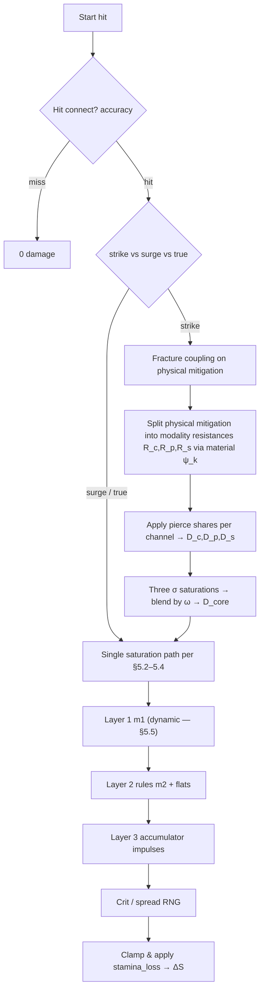

# Wildloom — gameplay & combat (master)

**Purpose:** Single planning document for **terminology**, **creature stats & materials**, **affinities and field**, **progression**, **Layer 2 reactions**, the **ability composer**, **move instances**, the **damage pipeline**, **Layer 3 accumulators**, DoT, and appendices. **Design-only** — not a mandate for repo folders or file formats.

**Also see:** [`DESIGN-SUPPLEMENT.md`](./DESIGN-SUPPLEMENT.md) (chart, statuses, stances, biomes, combos, artifact index). [`TECHNICAL-DESIGN.md`](./TECHNICAL-DESIGN.md) (product & architecture). [`SIMULATION-AND-PEDAGOGY.md`](./SIMULATION-AND-PEDAGOGY.md) (integration contract, pedagogy). [`PROCEDURAL-GENERATION.md`](./PROCEDURAL-GENERATION.md) (spawn). [`SPECIES-INSTANCE-EXAMPLES.md`](./SPECIES-INSTANCE-EXAMPLES.md) (instance sketches).

---

## 1. Terminology

| Term | Meaning |
|------|--------|
| **Affinity** | Primary combat element on a creature or move (discrete enum). |
| **Tags** | Extra labels on a move (`contact`, `thermal`, `crystalline`, …) used by reaction rules—not necessarily tied to affinity. |
| **Material profile** | Normalized latent attributes on a creature used only by Layers 2–3 (not the beginner chart). |
| **Layer 1** | Matchup multiplier \(m_1\) — **continuous function** of baseline tendencies plus attacker/defender stats, materials, affinity emphasis, move composition, and field (**bounded**, often \(\approx [0,2]\)); collapsed table view optional for onboarding ([§5.5](#55-layer-1--affinity-multiplier-m1)). |
| **Layer 2** | Data-driven predicate rules (physics-flavored hooks). |
| **Layer 3** | Continuous accumulators updated each subtick — full key list under **§D.interlude** (below). |
| **Strike modality** | How a **strike** splits across **concussive / piercing / slashing** channels (physics-flavored wound mechanics). In data: **`strike_modalities`** ω on **`category: strike`**. Distinct from move-field **`pierce`** (numeric armor bypass) — see [**§3.2**](#32-template-bounds-vs-resolved-instance--base_power-pierce-modality-ω). |
| **Delivery modality (surge)** | The **same** three-way ω simplex as strikes, stored as **`delivery_modalities`** on **`category: surge`** — same §5.4b math, but **`special_mitigation`** is the defense stack being split ([§5.4b](#54b-delivery-modality-blend--concussive-piercing-slashing-strike--surge)). |
| **`stamina`** | Schema id for **endurance capacity**: maximum **endurance pool** (rolled aptitude + training)—how long the creature can sustain effort before collapse. |
| **Current endurance** \(S(t)\) | Battle state scalar depleted by hits and continuous drains; UI may label “readiness” / “fight stamina.” Not “hit points” as a metaphor. |
| **Incapacitated** | \(S \le 0\) — combat loss condition (collapse / exhaustion); switches and XP behave like a knockout. |

Affinity IDs in **content data**: **twelve-ID** roster in [`GAMEPLAY-MASTER.md`](./GAMEPLAY-MASTER.md) §1; MVP resolver enums may ship **nine** first. Authoritative 12×12 **`CHART₀`** lives in [`DESIGN-SUPPLEMENT.md`](./DESIGN-SUPPLEMENT.md) §2. Older examples may say “Solar/Tidal”—swap at authoring time.

---

## 2. Creature attributes

### 2.1 Core combat stats (six-stat core — resolver)

Used everywhere in damage coupling, **initiative** order, and **endurance pool** sizing. **Schema ids** below are the **design vocabulary** for stats (implementation can mirror these names). Player-facing copy should use the **name** column; extended stats (**precision**, **recovery**, **coupling**) live in [`DESIGN-SUPPLEMENT.md`](./DESIGN-SUPPLEMENT.md) §3.

| Schema id | Name (player-facing) | Role | Notes |
|-----------|----------------------|------|--------|
| `stamina` | **Endurance capacity** | Pool ceiling \(S_{\max}\) | Current endurance \(S\) is battle state (\(0 \le S \le S_{\max}\)). **Instance** rolled aptitude + level budget **`B(L)`** + training derive \(S_{\max}\) — not a species lookup ([`TECHNICAL-DESIGN.md`](./TECHNICAL-DESIGN.md) §5). |
| `physical_offense` | **Physical offense** | Strike scaling | Used by **strike** moves in saturation vs **`physical_mitigation`**. |
| `physical_mitigation` | **Physical mitigation** | Strike defense | Reduces strike **endurance loss** (with saturation); fracture/posture may reshape effective mitigation (§5.7). |
| `special_offense` | **Special offense** | Surge scaling | Used by **surge** moves — field / non-contact potency (energy-amplitude metaphor). |
| `special_mitigation` | **Special mitigation** | Surge defense | Reduces surge **endurance loss** (with saturation). |
| `initiative` | **Initiative** | Speed / turn order | Turn order; optional accuracy/evasion hooks. |

**Endurance vs status — not the same defense:** The six core stats above (including **`physical_mitigation`** and **`special_mitigation`**) feed the **main strike/surge saturation pipeline** (§5): they absorb **endurance loss** \(\Delta S\) on the **`endurance_share`** branch. **Status resistance** is a **separate** surface — typically a **`status_guard`** vector (per affinity / family / global) that **`status_guard_shred_share`** and status payloads interact with ([§3.1](#31-damage-kind--outcome-partition-endurance--status-guard--utility-field)). A creature can be **high `special_mitigation`** (tanks beams well for stamina) but **low fire `status_guard`** (still ignites easily); conflating the two collapses build space.

**Why split `physical_` vs `special_` mitigation at all?** One number could in theory cover both; the project keeps **two stacks** so **contact / body** defense and **field / energy** defense can diverge (teaches distinct physics metaphors, avoids one “defense” stat governing every animation). Materials and Layer 2 still reshape both.

**Derived convenience (optional, recomputed each battle tick):**

- `effective_physical_offense = physical_offense * product(modifiers)`
- Same pattern for other stats—buffs apply as multiplicative or additive stacks with declared precedence (see §8).

### 2.2 Material profile (latent vector)

**Distribution intent:** Each **instance** rolls the full twelve-axis vector from **global/stage/encounter** priors ([`GAMEPLAY-MASTER.md`](./GAMEPLAY-MASTER.md) §4). Species catalog rows **do not** fix material means—dex entries are flavor-only ([`TECHNICAL-DESIGN.md`](./TECHNICAL-DESIGN.md) §1).

Per creature (rolled axes ± temporary battle modifiers). Components are **roughly in [0, 1]** after normalization.

**Authoritative twelve-component catalog** (same table as [`DESIGN-SUPPLEMENT.md`](./DESIGN-SUPPLEMENT.md) §4.1):

| Component | Meaning | Layer 2 / Layer 3 effect examples |
|-----------|---------|-----------------------------------|
| `thermal_mass` | Heat stored per degree; slows heating **and** cooling | \(\tau\) in thermal flow; dampens `heat_load` spikes |
| `conductivity` | Thermal + electrical transmission speed | Galvanic chain multiplier; heat equilibration rate |
| `rigidity` | Brittleness vs flexibility (0 ≈ rubber, 1 ≈ ceramic) | Fracture accumulation ψ; concussive transmission; Cryo vulnerability |
| `porosity` | Void fraction; holds fluid, absorbs corrosive | `wetness` retention; corrosion ingress rate; laceration depth |
| `polarity` | Permanent or induced electrical dipole | `charge_buildup` leakage; Galvanic resonance hooks |
| `density` | Mass per volume; inertia | Void damage scaling; sonic impedance \(Z \sim \rho v\); concussive baseline resistance |
| `elasticity` | Stores and returns deformation energy | Concussive rebound on contact moves; laceration healing rate analog |
| `reflectivity` | Electromagnetic surface reflectance | Reduces Luminous damage received; high values → beam reflect rules |
| `acoustic_impedance` | \(Z \approx \rho \times\) sound speed; mismatch → reflection | Sonic attack efficiency; high mismatch reflects more coupling |
| `chemical_reactivity` | Kinetics multiplier for corrosion | `corrosion` impulse scales strongly with reactivity × porosity |
| `magnetization` | Ferro/paramagnetic susceptibility | `magnetic_flux` sensitivity; Galvanic + Plasmic rule hooks |
| `permeability` | Gas/fluid penetration through body | Corrosive DoT ingress depth; Aero dehydration; deep-tissue flooding hooks |

**Composite shortcuts** (cached per tick for predicates — full formulas [`DESIGN-SUPPLEMENT.md`](./DESIGN-SUPPLEMENT.md) §4.3): `acoustic_transparency`, `fracture_susceptibility`, `corrosion_rate`, `ionic_coupling`, `thermal_stability`, `void_compression_factor`.

**Resolver fidelity (when you build):** early modality ψ kernels might sample only **`thermal_mass`, `conductivity`, `rigidity`, `porosity`, `polarity`**; the other seven material axes remain **design-forward** for Layer 2 rules, accumulators, and extended \(m_1\) terms.

**Rule:** Material profile **does not** replace core stats; it keys **Layer 2–3** and contributes terms to **dynamic Layer 1** (§5.5). New players can ignore it until inspect/advanced UI.

### 2.3 Identity flags (combat-relevant)

- **`affinity_emphasis`** (required on instances): vector or normalized weights over affinity IDs—implements **composed typings**. Catalog `primary_affinity` / `secondary_affinity` / `affinity_emphasis_hint` are **non-authoritative** dex seeds; combat MUST use the instance’s rolled emphasis ([`GAMEPLAY-MASTER.md`](./GAMEPLAY-MASTER.md) §1.2).
- **`species_tags`** optional defaults for rules (e.g. `crystalline_body`).
- Pass emphasis vectors + materials into **`m1`**; static charts alone are insufficient for target dynamism (§5.5).

---

## A. Affinities, field environment, progression

## 1. Affinity framework — twelve IDs, MVP ships nine

Layer 1 dynamic `m1` reshapes baseline `CHART₀` using emphasis vectors, stats, materials, move fusion, and field ([`GAMEPLAY-MASTER.md`](./GAMEPLAY-MASTER.md) §5.5). Layer 2 uses predicate rules (§2.2 below) plus combos/stances in [`DESIGN-SUPPLEMENT.md`](./DESIGN-SUPPLEMENT.md). Layer 3 scalars are listed only in [`GAMEPLAY-MASTER.md`](./GAMEPLAY-MASTER.md); statuses tied to thresholds are in [`DESIGN-SUPPLEMENT.md`](./DESIGN-SUPPLEMENT.md) §8.
### 1.0 Twelve-affinity roster (target content IDs)

| ID | Affinity | Theme (short) |
|----|----------|----------------|
| `TH` | **Thermal** | Heat, combustion, convection |
| `CY` | **Cryo** | Cold, entropy, brittle setups |
| `AQ` | **Aqueous** | Liquids, wetness, pressure |
| `GA` | **Galvanic** | Charge, circuits, arcs |
| `MI` | **Mineral** | Stone, crystal, grounding |
| `FL` | **Flora** | Biomass, sustain, DoT |
| `AE` | **Aero** | Gas, wind, field spread |
| `LU` | **Luminous** | Light, surge pierce |
| `VO` | **Void** | Vacuum / isolation, compression flavors |
| `SO` | **Sonic** | Resonance, impedance, medium |
| `CR` | **Corrosive** | Acid/base kinetics, armor erosion |
| `PL` | **Plasmic** | Ionized burst, ionization field |

Authoritative **`CHART₀`**, Sonic/Corrosive/Plasmic mechanics, statuses, and biomes: [`DESIGN-SUPPLEMENT.md`](./DESIGN-SUPPLEMENT.md) §§1–2, §§8–13.

### 1.1 MVP nine (resolver ships first)

Early engine enums may omit **`sonic`**, **`corrosive`**, **`plasmic`** until content hooks land; design assumes they eventually participate in the **same** Layer 1–3 machinery.

To keep the matchup chart readable during onboarding, tutorials may **collapse** affinities into the nine-row summary below (still physics-flavored naming).

| Affinity | Theme & metaphor | Identity / playstyle |
|----------|------------------|----------------------|
| **Thermal** | Heat, combustion, plasma | Burst pressure; builds `heat_load`; melting hooks. |
| **Cryo** | Cold, entropy, crystallization | Tempo pressure; brittle setups; draws thermal energy down. |
| **Aqueous** | Liquids, solutions, pressure | Utility; sets `wetness`; pairs with `porosity`. |
| **Galvanic** | Electricity, magnetism, charge | Tempo; chains via `conductivity`; control spikes. |
| **Mineral** | Earth, crystal, metals | Physical mitigation; `rigidity` / shatter loops. |
| **Flora** | Biomass, vines, spores | Sustain / drains (DoT); often higher `thermal_mass`. |
| **Aero** | Gas, pressure waves, wind | Evasion hooks; spreads field accumulators. |
| **Luminous** | Light, lasers, radiation | Surge-focused piercing; interacts with **`special_mitigation`** more than **`physical_mitigation`**. |
| **Void** | Gravity, vacuum, isolation | Compression on effective **`stamina` / endurance ceiling**; deliberately orthogonal physics hooks. |

**Open decision:** Keep this “physics-first” naming, push further into non-element metaphors, or split “identity” vs “damage flavor” for readability—finalize before shipping tutorial copy.

---

## 1.2 Procedural uniqueness, composed typings, and move authoring

**Creature instances:** Spawns roll from `biome_id` + seed — emphasis biased to biome, with `p_neutral_primary` and a secondary-chip rarity axis ([`PROCEDURAL-GENERATION.md`](./PROCEDURAL-GENERATION.md)). Nine stats use tier-gated bell curves, not species-fixed sheets. Species catalog rows are identity only (names, stages, habitat). Optional YAML shape samples: [`SPECIES-INSTANCE-EXAMPLES.md`](./SPECIES-INSTANCE-EXAMPLES.md).

**Typing:** Combat uses `affinity_emphasis` over twelve IDs (or nine until unlocked). The instance payload is authoritative.

**Abilities & moves:** **Frames** supply authoring **envelopes** (min/max bands, allowed hooks). Players and trainers compose **full instances** per [`GAMEPLAY-MASTER.md`](./GAMEPLAY-MASTER.md) **Ability composer** (eight **`category`** targets, affinities, ω, partition, effects, continuous potency) within frame + budget constraints — persisted fields in [`GAMEPLAY-MASTER.md`](./GAMEPLAY-MASTER.md) §3, **§3.0**. Unlock gates use rolled stats, materials, and emphasis.

**Battles:** Arenas compose from biome / field primitives ([`DESIGN-SUPPLEMENT.md`](./DESIGN-SUPPLEMENT.md) §12; [`TECHNICAL-DESIGN.md`](./TECHNICAL-DESIGN.md) §1).
---

## 1.3 Ability payloads mirror creature battle hooks

Design rule: hooks that matter on creature instances — volatile statuses, Layer 3 deltas, passive affinity shaping, aura ticks — must also be expressible as player-authored selections on moves/passives, bounded per template.

| Hook family | On creatures | On abilities (templates → resolved move) |
|-------------|--------------|------------------------------------------|
| Elemental emphasis | Rolled at spawn from biome + RNG | Player picks `primary` / `secondary` / `affinity_weights` within template |
| Stats | Rolled aptitudes + growth | N/A directly — abilities scale off attacker stats via resolver |
| Status guard | Creature `status_guard` softens disables / DoTs | Moves allocate `status_guard_shred_share` vs `status_delivery_share` and `endurance_share` ([`GAMEPLAY-MASTER.md`](./GAMEPLAY-MASTER.md) §3.1) |
| Statuses | Auras, terrain, items | `on_hit_status`, `self_status`, `target_status` payloads |
| Field identity | Arena `terrain_id`, `field_flags`, ambient scalars ([`DESIGN-SUPPLEMENT.md`](./DESIGN-SUPPLEMENT.md) §12) | `utility_field_share`, `utility_pressure_share` ([`GAMEPLAY-MASTER.md`](./GAMEPLAY-MASTER.md) §3.1) |
| Accumulators | Trait passives integrate \(\mathrm{d}u/\mathrm{d}t\) | `accumulator_impulses` — keys from [`GAMEPLAY-MASTER.md`](./GAMEPLAY-MASTER.md) |
| Passive affinity | Flavor / traits bias Layer 2 | `passive_affinity_emphasis` on passive shell |

Resolver ordering: [`GAMEPLAY-MASTER.md`](./GAMEPLAY-MASTER.md) §5 — impulses feed Layer 3 after Layer 2 unless a rule preempts.
---

## 3. Field scalars & ambient states

Replace binary weather with **continuous environment** where possible; seed from terrain / overworld room config.

| Scalar | Example default | Mechanics sketch |
|--------|-----------------|------------------|
| `ambient_temp` | 20 (dimensionless UI units or °C—pick one and normalize) | Modulates `heat_load` decay; optional tiny Thermal surge bias per degree above baseline. |
| `humidity` | 0.5 (0–1) | High humidity adds passive `wetness` ticks; low humidity evaporates `wetness`. |
| `terrain_id` | `neutral` | Typed overrides—e.g. `conductive_grid` boosts conductivity; `overgrown_roots` grants Flora regen ticks. |

Server owns authoritative values; clients interpolate for VFX only.

Optional **derived field cues** (author decides whether to expose raw numbers): e.g. a saturation-like composite of `ambient_temp` + `humidity` drives passive wetness gain (“sticky air” intuition)—keep formulas monotonic and documented so players aren’t fooled into fake thermodynamics.

---

## 4. Stat growth — fully rolled aptitudes + visible Resonance

**Goals:** Every instance’s combat math comes from **rolls + training**, not from a hidden species spreadsheet. Compatible with infinite-level **`B(L)`** ([`TECHNICAL-DESIGN.md`](./TECHNICAL-DESIGN.md) §1, §5).

### 4.1 Rolled aptitudes (no species base vector)

- At creation/capture, sample a **raw aptitude vector** over the six core stats (and separately over extended stats if enabled) from **global/stage/encounter** distributions scaled by **`B(L)`** — **not** from species id.
- Apply **genetic jitter** (e.g. narrow noise per axis), **fully visible** immediately.
- **Material profile:** independent roll over **twelve** axes ([`DESIGN-SUPPLEMENT.md`](./DESIGN-SUPPLEMENT.md) §4) — species line does not fix morphology numbers.

### 4.2 Resonance (training allocation)

Working name: **Resonance** — transparent spendable budget (replaces invisible EV grind).

- **Accrual:** per level through phase boundaries; post-100 diminishing accrual consistent with grind philosophy (data-owned).
- **Allocation:** hubs (“tuning stations”) into whichever stats the design exposes (six core + optional **precision / recovery / coupling**).
- **Hard cap:** e.g. no single stat >40% of allocated pool at a snapshot — avoids breaking saturation math.

### 4.3 Combined stat formula (conceptual)

For a core stat `S` at level `L`:

\[
S_{\text{final}} = \Bigl( A_{\text{rolled}} + R_{\text{allocated}} \Bigr) \cdot f_{\text{growth}}(L)
\]

- \(A_{\text{rolled}}\) is the **instance** aptitude draw (+ jitter), **never** a species table lookup.
- \(f_{\text{growth}}(L)\) follows Phase A / B ([`TECHNICAL-DESIGN.md`](./TECHNICAL-DESIGN.md) §1).
- Extended stats either roll independently or use **global** maps \(g_j(A_{\text{rolled}})\), not per-species curves ([`DESIGN-SUPPLEMENT.md`](./DESIGN-SUPPLEMENT.md) §3.3 migration is **default prior for simulators**, not a creature definition).

---

## 5. Stealth physics-literacy map (affinities → intuition targets)

### 5.1 Energy / material affinities

Not lesson plans—**design targets** for observable behavior + copy. Real classrooms optional.

| Affinity | Player-learnable intuition | Observable hooks |
|----------|---------------------------|------------------|
| Thermal | Heat accumulates and dissipates toward ambient | `heat_load` meter relaxes faster/slower with mass |
| Cryo | Removing heat stresses brittle structures | spike rules when hot+rigid |
| Aqueous | Moisture couples to environment | wetness ↔ humidity exchange |
| Galvanic | Stored charge leaks faster when conductive paths exist | `charge_buildup`, wetness gates |
| Mineral | Stiff materials concentrate stress → fracture | fracture ↔ rigidity |
| Flora | Mass dampens thermal swings | slower \(dH/dt\) ramps |
| Aero | Fluids carry scalars (spread/dilute) | field clears / spreads accumulators |
| Luminous | Energy carriers bypass some material paths | surge-first tuning |
| Void | Isolation / compression metaphors | `stamina` / \(S_{\max}\) compression separate from chemical physics |
| Sonic | Periodic forcing + impedance | `sonic_stress`; resonance combos vs rigid bodies |
| Corrosive | Rate laws erode defense over time | `corrosion`; long-fight pressure |
| Plasmic | Ionized burst + field coupling | `ionization`; synergizes with Galvanic hooks |

### 5.2 Modality blend — strikes & surges (Bludgeon / Pierce / Slash)

**Player UI** may label the ω simplex **Bludgeon · Pierce · Slash**; schema keys remain **`concussive` · `piercing` · `slashing`** (bludgeon = concussive). The same three-way split applies to **`category: surge`** as **`delivery_modalities`** vs **`special_mitigation`** ([`GAMEPLAY-MASTER.md`](./GAMEPLAY-MASTER.md) §5.4b, §3.2; [`GAMEPLAY-MASTER.md`](./GAMEPLAY-MASTER.md) §4).

| Modality | Physics metaphor (toy fidelity) | Literacy hook |
|----------|---------------------------------|---------------|
| Concussive | Momentum transfer through shells/tissue | Shock lingers as `concussion`; rigid shells may transmit more unless damped |
| Piercing modality | Contact pressure / stress concentration | Uses move `pierce` strongly; couples to `fracture` on brittle faces |
| Slashing | Shear + tear along surfaces | Opens `laceration`; humidity/porosity amplify bleed drivers |

---

---

## B. Layer 2 — signature reactions

### 2.2 Signature reaction rules (Layer 2)
Author as data (reaction rule sets) with priorities. Examples:

1. **Thermal shock**  
   - **When:** Cryo-tagged move hits defender with **high** `heat_load` **and** high `rigidity`.  
   - **Then:** Clear part of `heat_load`, spike `fracture`, optional flat burst + log line for UI.

2. **Superconduct**  
   - **When:** Galvanic move; defender `wetness > 0.5` **or** `conductivity > 0.8`.  
   - **Then:** Temporary pierce on **`special_mitigation`** (not automatic everywhere—scope per rule), optional splash to bench (PvP ruleset gated).

3. **Steam expansion**  
   - **When:** Thermal move; defender `wetness > 0.5`.  
   - **Then:** Consume/drain `wetness`, apply **initiative** penalty debuff, set Layer 2 multiplier bump (e.g. `m2 × 1.3` cap-checked).

4. **Armor pierce alignment**  
   - **When:** Move tag `armor_piercing` **and** defender `fracture > θ`.  
   - **Then:** Temporarily boost **`pierce` scalar** or piercing modality pierce-share—keep audit trail per [`GAMEPLAY-MASTER.md`](./GAMEPLAY-MASTER.md) §5.2 vs §5.4b separation.

5. **Concussion spike**  
   - **When:** `concussion` crosses threshold **and** defender lacks stance buff.  
   - **Then:** Force slower **initiative** segment / accuracy slump—avoid hard stun RNG where possible (smooth debuffs).

6. **Open shear**  
   - **When:** `laceration` rising **and** follow-up slashing hit while `wetness` high.  
   - **Then:** Amplify DoT potency cap-checked—requires bracket governance for competitive modes.

Exact numbers ship from balance JSON, not this prose.

---


---

## C. Ability composer (normative player model)

## Ability composer (normative player model)

The editor is a set of **panels** (order in product UI is flexible). Together they define one **legal** resolved ability the combat spec consumes (field names in [`GAMEPLAY-MASTER.md`](./GAMEPLAY-MASTER.md) §3).

### 1. Schedule kind — `category`

| `category` | Plain-language role |
|------------|---------------------|
| **`strike`** | Contact / body hit — saturates vs **`physical_mitigation`** ([`GAMEPLAY-MASTER.md`](./GAMEPLAY-MASTER.md) §5). |
| **`surge`** | Energy / field packet — saturates vs **`special_mitigation`** (same §5.4b **ω** machinery, different defense stack). |
| **`true`** | Endurance loss that **skips** `physical_mitigation` / `special_mitigation` saturation (other absorbs may still apply). |
| **`field`** | Rewrites **arena / context** scalars — [`DESIGN-SUPPLEMENT.md`](./DESIGN-SUPPLEMENT.md) §5.3. |
| **`reactive`** | **Triggered** action (e.g. Primed stance) — §5.4 ibid. |
| **`channel`** | **Sustained** partial hits over subticks — §5.5 ibid. |
| **`resonance`** | Tied to **training Resonance** budget — §5.6 ibid. |
| **`catalyst`** | **Primes** combos / accumulators — §5.7 ibid. |

**Design target:** all **eight** are **first-class player choices**. A first implementation might ship fewer kinds; the **spec** is the full set ([`DESIGN-SUPPLEMENT.md`](./DESIGN-SUPPLEMENT.md) §5.1).

### 2. Frame — `template_id` + display label

**What the player picks:** A **frame** (e.g. **Blast**, **Slam**, **Field seed**) that defines **default bands**, **cooldown curve shape**, and which **hook families** the slot may attach.

- A **frame is not the damage type** — it is an **envelope** and a **display seed** ([Dynamic display names & nicknames](#dynamic-display-names--nicknames)).
- Many frames can share one **`category`**. “Fully dynamic” means every exposed slider may sit **anywhere** in `[min, max]` for that frame.

**Illustrative frame roster (design reference):** [Frame list](#illustrative-frame-list-design-reference).

### 3. Affinity identity

**Primary:** **thermal, cryo, aqueous, galvanic, mineral, flora, aero, luminous, void, sonic, corrosive, plasmic**, or **none / null** (non-elemental).

**Secondary:** optional; must differ from primary when set.

**Blend:** continuous **`blend_eta`** (within frame limits) between primary and secondary.

**Advanced:** full **`affinity_weights`** simplex for multi-way fusion ([`GAMEPLAY-MASTER.md`](./GAMEPLAY-MASTER.md) §3, §5.5).

### 4. Coupling shape — where the *hit* goes (ω simplex)

**Player-facing labels** may read **Bludgeon · Pierce · Slash**. Spec / persistence labels remain **`concussive` · `piercing` · `slashing`** (**bludgeon =** blunt impulse / shock).

**What the player picks:** three **non-negative** weights **summing to 1** — continuous on that simplex.

| Schedule kind | Field name | Mitigation stack |
|---------------|------------|------------------|
| **`strike`** | **`strike_modalities`** | **`physical_mitigation`** ([`GAMEPLAY-MASTER.md`](./GAMEPLAY-MASTER.md) §5.4b). |
| **`surge`** | **`delivery_modalities`** | **`special_mitigation`** (same math). |

**Optional `pierce` ∈ [0, 1]:** mitigation **bypass** after ω split — not the Pierce **weight** ([`GAMEPLAY-MASTER.md`](./GAMEPLAY-MASTER.md) §3.3).

Kinds that skip strike/surge saturation omit ω or use substitutes ([`GAMEPLAY-MASTER.md`](./GAMEPLAY-MASTER.md) §3).

### 5. Potency & precision (continuous scalars)

| Control | Role |
|---------|------|
| **`base_power`** | Amplitude into coupling / saturation — any value in the frame’s band. |
| **`accuracy`** | Hit-odds driver ([`GAMEPLAY-MASTER.md`](./GAMEPLAY-MASTER.md) §5.1). |
| **`cooldown`** | Mapped from committed power — smooth anti-spam, not tier tables. |

### 6. Outcome budget — stamina vs resist vs riders

**Separate from Panel 4:** Panel 4 is *how* endurance couples; Panel 6 is *what the package pays for*.

Continuous shares (**sum 1**): **`endurance_share`**, **`status_guard_shred_share`**, **`status_delivery_share`**, plus utility shares on relevant frames ([`GAMEPLAY-MASTER.md`](./GAMEPLAY-MASTER.md) §3.1).

### 7. Effects & flourishes

| Bucket | Player intent | Design fields |
|--------|----------------|---------------|
| **Statuses** | Which riders / disables to try | **`status_payloads`** (ids, lanes, potency/duration bands) |
| **Accumulators** | Heat, ionization, fracture, … | **`accumulator_impulses`** · [`GAMEPLAY-MASTER.md`](./GAMEPLAY-MASTER.md) |
| **Infusions / shell** | Passive-**flavored** bias (e.g. discharge flavor) | **`infusion_coeffs`**, **`passive_hooks`** ([`GAMEPLAY-MASTER.md`](./GAMEPLAY-MASTER.md) §1.3) |

[`DESIGN-SUPPLEMENT.md`](./DESIGN-SUPPLEMENT.md) §7 names (e.g. **Arc Discharge**) are **creature passive patterns** — the composer exposes **bounded analogs** on moves, not copy-paste of wild traits.

### 8. Balance contract

| Layer | Role |
|-------|------|
| **Frame envelopes** | **`min` / `max`** per knob; optional UI **step** only. |
| **Loadout budget** | High potency + many hooks **costs budget** — [`Bounds vs balance`](#bounds-vs-balance--why-drag-everything-to-max-is-not-the-whole-story). |
| **Combat curves** | Saturation, **`m1`** caps — [`GAMEPLAY-MASTER.md`](./GAMEPLAY-MASTER.md) §5, §5.5. |

---

## Composer → persistence (conceptual field names)

| Panel | Fields (see [`GAMEPLAY-MASTER.md`](./GAMEPLAY-MASTER.md) §3) |
|-------|--------------------------------------------------------|
| 1 Schedule | `category` |
| 2 Frame | `template_id`, display name |
| 3 Affinity | primary/secondary, `blend_eta`, `affinity_weights` |
| 4 Coupling | `strike_modalities` or `delivery_modalities`, optional `pierce` |
| 5 Potency | `base_power`, `accuracy`, cooldown |
| 6 Outcome | `damage_outcome_partition`, `damage_kind` |
| 7 Effects | `status_payloads`, `accumulator_impulses`, `passive_hooks`, `infusion_coeffs` |

---

## Dynamic display names & nicknames

1. **Frame label stays short** (e.g. **Blast**).
2. **Default title = frame** until a composer rule adds tokens.
3. **Tokens from player choices only** — affinities, skewed ω, statuses, schedule archetypes.
4. **No lane words from silent defaults.**
5. **Deterministic** titles for the same instance.
6. **Optional `move_nickname`.**

**Composer gates:** affinity chips; modality adjective only if dominant ω beats a **prominence floor** (tune in balance doc, not here); status rows; schedule archetypes when applicable.

---

## Bounds vs balance — why “drag everything to max” is not the whole story

| Mechanism | Role |
|-----------|------|
| **Loadout / tuning budget** | Raises on one panel steal points from others. |
| **Meta costs** | Cooldown, stamina, Resonance, stance costs ([`GAMEPLAY-MASTER.md`](./GAMEPLAY-MASTER.md); [`TECHNICAL-DESIGN.md`](./TECHNICAL-DESIGN.md)). |
| **Coupled envelopes (optional)** | Correlated min/max so the feasible set is not a box. |
| **Saturation & `m1`** | [`GAMEPLAY-MASTER.md`](./GAMEPLAY-MASTER.md) §5. |

**Frame envelopes are not the economy layer** — **game rules** enforce budget and legality.

---

## Illustrative frame list (design reference)

| Frame id (example) | Display label (example) | `category` |
|--------------------|-------------------------|------------|
| `blast` | Blast | surge |
| `lance` | Lance | surge |
| `burst` | Burst | surge |
| `siphon` | Siphon | surge |
| `prism` | Prism | surge |
| `noiseburst` | Noiseburst | surge |
| `collapse` | Collapse | surge |
| `slam` | Slam | strike |
| `thrust` | Thrust | strike |
| `rend` | Rend | strike |
| `tempered` | Tempered | strike |
| `gale_drive` | Gale drive | strike |
| `spike` | Spike | true |
| `field_seed` | Field seed | field |
| `focus_bridge` | Focus bridge | channel |
| `parried_arc` | Parried arc | reactive |

When you implement, you can store this roster however you like; the **design** is “many frames per kind, all customizable within envelopes.”

---

---

## D. Moves, battle context & damage resolution

## 3. Moves

### 3.0 Ability composer (player ↔ persistence)

**Normative UX contract:** Players assemble each equipped ability from **schedule kind**, **frame**, **affinities**, **coupling shape** (Bludgeon/Pierce/Slash ω), **outcome budget** (stamina vs status-guard shred vs riders), **effect picks**, and **continuous potency** — all inside template bands and loadout budget ([`GAMEPLAY-MASTER.md`](./GAMEPLAY-MASTER.md) *Ability composer*). The field table below is the **persistence / resolver** view of those panels.

Each move carries:

| Field | Purpose |
|-------|---------|
| `category` | **Design target:** **eight** player-selectable kinds — **`strike`**, **`surge`**, **`true`**, **`field`**, **`reactive`**, **`channel`**, **`resonance`**, **`catalyst`** ([`DESIGN-SUPPLEMENT.md`](./DESIGN-SUPPLEMENT.md) §5.1; [`GAMEPLAY-MASTER.md`](./GAMEPLAY-MASTER.md) §1). An MVP build might ship a subset first; the spec is the full eight. |
| `base_power` | Non-negative scalar; can be 0 for utility. |
| `affinity` | Optional chart key for Layer 1 / stab hooks — **omit or null** for non-elemental builds (neutral baseline multiplier until emphasis/`affinity_weights` fully reshape §5.5). |
| `affinity_weights` | Optional simplex over affinity IDs (sums to `1`) — **Luminous–Mineral Blast** style fusion; feeds §5.5 with `affinity`. |
| `template_id` | Optional **frame** key (**`blast`**, **`slam`**, …) — labels the ability **envelope** in [`GAMEPLAY-MASTER.md`](./GAMEPLAY-MASTER.md); not category-prefixed. |
| `infusion_coeffs` | Optional bag of **continuous** tuning knobs (e.g. tag intensity, modality tilt, pierce bias)—serialized for replay; bounded per move family. |
| `tags` | Set of strings for predicates (`thermal`, `aqueous`, `contact`, …). |
| `pierce` | Fraction in `[0, 1]` — geometric / armor bypass applied **per modality** (§5.4b); strongest on the **piercing** channel by default. Distinct from **piercing ω** — [**§3.2**](#32-template-bounds-vs-resolved-instance--base_power-pierce-modality-ω). |
| `strike_modalities` | Optional ω simplex on **strike** moves (`delivery_modalities` absent); omit ⇒ blunt-only legacy path. [**§3.2**](#32-template-bounds-vs-resolved-instance--base_power-pierce-modality-ω). |
| `delivery_modalities` | Same ω shape on **surge** moves (e.g. Blast) — partitions coupling across concussive / piercing / slashing **delivery** into **`special_mitigation`** with the same material ψ kernels as §5.4b. Resolver prefers `delivery_modalities` when both fields are present. [**§3.2**](#32-template-bounds-vs-resolved-instance--base_power-pierce-modality-ω). |
| `cooldown_turns` | Integer turns before reuse — hydrate from template **`cooldown_scaling`** × **`base_power`** (stronger customization ⇒ longer wait); consumed by turn scheduler, not `resolveHit`. |
| **`status_payloads`** (planned hydrate) | Optional **`on_hit` / `on_tick` / `self`** status applications — effect id, duration subticks, potency, stacking rule ref, proc chance — **bounded per template** like other sliders ([`GAMEPLAY-MASTER.md`](./GAMEPLAY-MASTER.md) §1.3). |
| **`accumulator_impulses`** (planned hydrate) | Optional structured deltas on Layer 3 keys — same vocabulary as [`GAMEPLAY-MASTER.md`](./GAMEPLAY-MASTER.md); triggered on hit / crit / channel tick. |
| **`passive_hooks`** (planned hydrate) | Optional slot-bound **passive affinity emphasis**, aura ticks, or stance coupling — player selects within authored simplex / intensity bands; mirrors passive-ish creature traits without duplicating math. |
| `damage_kind` | On the **resolved instance** — declares primary outcome lane for UX + resolver; see [**§3.1**](#31-damage-kind--outcome-partition-endurance--status-guard--utility-field). Catalog templates **omit** a per-row default — product/UI picks first-run lane policy (often endurance for offensive frames) until the player edits partition shares. |
| **`damage_outcome_partition`** (planned hydrate) | Normalized shares (simplex or authored clamped tuple) that split the move’s **resolved coupling budget** after saturation / \(m_1\) / Layer 2 — see §3.1. |
| **`system_display_title`** (planned) | Deterministic **composed label** from **frame + player-selected tokens only** — see [`GAMEPLAY-MASTER.md`](./GAMEPLAY-MASTER.md) *Dynamic display names & nicknames*. Catalog rows do not imply lane words; balanced modality ω and other **silent defaults** also stay off the title. |
| **`move_nickname`** (planned) | Optional player headline; **subtitle** still shows **`system_display_title`**. |

**True damage:** Skips **saturation path using `physical_mitigation` / `special_mitigation`** but may still be altered by global shields or scripted absorbs—declare explicitly per effect.

### 3.1 Damage kind · outcome partition (endurance · status guard · utility field)

**Plain English:** Most attacks compute one **potency package** from offense, mitigation, modalities, Layer 1 \(m_1\), and RNG — a “how hard did this connect?” budget. **`damage_kind`** says what the move is *about* in UI and which resolver branch runs first; **`damage_outcome_partition`** (player-slidable within template bands) says **where that budget lands**: fighting stamina (**endurance**), peeling **status defenses**, powering **DoTs / disables**, and/or **rewriting the arena field** while optionally pinching the foe’s stats.

| Symbol / field | Meaning |
|----------------|---------|
| **`damage_kind`** | **`endurance`** — chip emphasizes stamina loss; **`status`** — chip emphasizes riders / guard break; **`utility`** — chip emphasizes **field** mutation; resolver still honors explicit partition shares (below), so kinds are not mutually exclusive “silos” once partitioning ships. |
| **`α` · `endurance_share`** | Fraction of the move’s **budget** applied as **`stamina_loss`** (↓ \(S\)) — the familiar “HP-like” chunk. |
| **`β` · `status_guard_shred_share`** | Fraction spent attacking **status resist infrastructure** on the defender — abstractly “how hard you negate fire resist / cleanse buffers / ward stacks,” implemented as smooth deltas on **`status_guard`** stats (per affinity family and/or global wash). Higher \(\beta\) makes **subsequent** burns, poisons, stuns, etc. land heavier **without** doubling raw stamina chip unless \(\alpha\) is also high. Thematic example: a **Thermal** rider-heavy blast can slide \(\beta\) up to specialize as a **“fire resist negating”** opener. |
| **`γ` · `status_delivery_share`** | Fraction allocated to **amplifying status payloads on this swing** — proc reliability, potency ceilings, stack progression, or pierce-through-cleanse hooks tied to **`status_payloads`** ([`GAMEPLAY-MASTER.md`](./GAMEPLAY-MASTER.md) §1.3). Think “same animation, more of the budget goes into making the DoT stick.” |
| **`φ` · `utility_field_share`** | (**`utility`** moves) Fraction pushing **arena transition** — shifting **`terrain_id`** flavor, **`field_flags`**, ambient scalars (`ambient_temp`, `humidity`, ionization, …) toward an authored target profile ([`DESIGN-SUPPLEMENT.md`](./DESIGN-SUPPLEMENT.md) §12). Example: **grassland → fire-field** bias increases thermal coupling field-wide over subsequent subticks. |
| **`ψ` · `utility_pressure_share`** | (**`utility`** moves) Fraction that **still pressures combatants’ stats** during the transition — e.g. brief **`initiative`**, **`coupling`**, or **`special_mitigation`** penalties on foes while the field “catches fire,” so terrain shifts are not free stapled passes. \(\psi\) answers “you changed the weather — does it also **hit their footing**?” |

**Constraints (design intent):** \(\alpha+\beta+\gamma+\phi+\psi = 1\) on moves that declare a **full partition**; templates may fix \(\phi=\psi=0\) for pure brawlers or \(\alpha=0\) for pure field seeds until economy dictates otherwise. **Loadout budget** competes: raising \(\beta\) or \(\gamma\) usually trades against \(\alpha\) within the same **`base_power`** band unless the player pays extra tempo / cooldown / resonance ([`GAMEPLAY-MASTER.md`](./GAMEPLAY-MASTER.md) bounds vs balance).

**Resolver sketch:** One coupling sample \(B\) from §5 pipeline (possibly scaled when **`damage_kind`** biases weights). Apply \(\alpha B \rightarrow \Delta S\); \(\beta B \rightarrow\) defender **`status_guard`** vector (smooth, logged); \(\gamma B \rightarrow\) scale **`status_payloads`** effective potency / proc layer; \(\phi B \rightarrow\) integrate **`field_state`** toward target; \(\psi B \rightarrow\) apply scripted transient debuffs on targeted foes’ **`stats_eff`** or accumulator influx. Exact maps live in balance JSON when implemented — **the contract here** is player-visible **sliders** and replay-stable decomposition.

**Creature symmetry:** Spawned creatures can expose **`status_guard`** and field interaction stats the same way — player moves mirror that vocabulary ([`GAMEPLAY-MASTER.md`](./GAMEPLAY-MASTER.md) §1.3).

**Compositional moves:** Players and designers assemble **display names** from template + infusions (“Void Blast”, “Floral Surge”, …). Mechanics depend on **`affinity_weights`**, **`infusion_coeffs`**, and stats—not on the display string alone.

**Naming:** **`pierce` (field)** = scalar bypass knob on data. **“Piercing” modality** = localized stress concentration / stab geometry feeding its **own** saturation branch—do not conflate the two in authoring tools.

### 3.2 Template bounds vs resolved instance — `base_power`, `pierce`, modality ω

**Plain English:** “Dynamic / compositional” does **not** mean “no numbers on the move.” It means the **species row** does not fix combat values, and the **player (or procedural trainer)** picks concrete numbers **inside envelopes** set by the chosen **frame** (min/max/step per knob from the ability author). The **frame** = *feasible region*; the **resolved move instance** = *one point* in that region, plus affinities, partition, payloads, etc. — see [`GAMEPLAY-MASTER.md`](./GAMEPLAY-MASTER.md) **Ability composer**.

| Field | Role | “Why not ‘fully emergent’ with no sliders?” |
|-------|------|---------------------------------------------|
| **`base_power`** | Scales the hit’s **potency budget** going into saturation (with level / items / field — §5.3–5.4). Higher ⇒ more coupling **before** mitigation; trades against cooldown, other sliders, and loadout budget. | You still need **one scalar amplitude** (or an equivalent parameterization) so balance, previews, and `cooldown_scaling` stay legible. The **player chooses** it within the frame’s band — it is not a hidden species constant. |
| **`pierce`** | In `[0, 1]`: **global armor-bypass** trim applied **after** ω splits the hit into channels, with per-channel weights λ (§5.2, §5.4b). | Separate from **piercing ω**: ω decides **how much** of the attack *behaves like* a stab vs shock vs cut for material ψ and saturation branches; **`pierce`** shrinks effective defense in each branch. A “beam” and a “needle” can both be surges with different ω; either can raise **`pierce`** to ignore mitigation further. |
| **`strike_modalities` ω** | On **strikes** only: simplex weights \((\omega_c,\omega_p,\omega_s)\) summing to **1** — partition of coupling across **concussive / piercing / slashing** pathways vs **`physical_mitigation`** (§5.4b). | Same mechanics for every strike template (`slam`, `thrust`, …); the **frame** changes default bands and narrative, not the ω math. |
| **`delivery_modalities` ω** | On **surges** only: **identical** simplex semantics, but \(B_{\mathrm{eff}}\) is **`special_mitigation`** so “shockwave vs laser vs tearing arc” shapes **energy-like** defense, not contact physics (§5.4b). Resolver uses `delivery_modalities` when present for surge. | One ω system for both categories avoids doubling saturation code; only the **defense stat** and **field name** change. |

**Consistency rule:** For a given resolved move, use **`strike_modalities`** **xor** **`delivery_modalities`** according to **`category`** — never both. Omitting ω on strikes ⇒ blunt-only legacy path (§3 table).

**Schema naming:** Only the **field name** differs between strike and surge — both hold the **same** ω simplex ([§5.4b](#54b-delivery-modality-blend--concussive-piercing-slashing-strike--surge)). A unified `modalities` property could exist in a later schema; today **`category`** selects which **`CoreStats`** mitigation column is \(B_{\mathrm{eff}}\).

### 3.3 Why `pierce` is not “already in” the modality taxonomy

**Piercing ω** (the **piercing** component of the simplex) answers: *what fraction of this hit follows the **piercing branch’s** geometry* — which material kernel \(\psi_{\mathrm{pier}}\), which saturation curve, how much couples to **`fracture`** hooks, etc. It is **not** automatically “armor penetration,” only “stab-shaped coupling.”

The scalar **`pierce`** field answers a different question: *what fraction of **effective mitigation** do we discard on **each** channel before saturation?* (§5.2, §5.4b, with per-channel λ weights.) That is **shield-break / barrier-ignore** tuning: you can have a **mostly concussive** shockwave (**low** piercing ω) that still carries **`pierce`** to punch through generic **`special_mitigation`**, or a **needle beam** (**high** piercing ω) with **`pierce = 0`** for pure shape without extra bypass.

| Knob | Controls | Analogy |
|------|----------|--------|
| **ω** (incl. ω_p) | **How** the force is routed for materials + multi-branch math | Hammer vs nail vs blade — *which impedance formulas apply* |
| **`pierce`** | **How much** of the defender’s mitigation stat stack counts before those formulas | Armor-piercing / shield-piercing — *how much of \(D\) you pretend isn’t there* |

**If you want fewer levers:** Product can **derive** an effective pierce from **`infusion_coeffs`** or cap **`pierce`** by template family; or merge into one “anti-mitigation” infusion. The **spec** keeps them separate so **shape** and **generic bypass** are independently balanceable without forcing every armor-ignoring effect to look like a stab in ω.

---

## 4. Battle context (what the resolver reads)

Immutable snapshot per resolution step (plus RNG stream):

- Attacker/defender **stats effective** after temporary buffs.
- **Level** `L_a`, `L_d` (for scaling guardrails).
- **Affinity emphasis** vectors (and optional primary/secondary summaries).
- **Material** vectors `M_a`, `M_d`.
- **Field scalars:** `ambient_temp`, `humidity`, `terrain_id`, etc.
- **Per-combatant scalars:** Layer 3 accumulators — full key list [`GAMEPLAY-MASTER.md`](./GAMEPLAY-MASTER.md).
- **Active statuses** from terrain, abilities, items — predicates read **`volatile`** / **`status`** bags ([`DESIGN-SUPPLEMENT.md`](./DESIGN-SUPPLEMENT.md) statuses).
- Move **tags** and **category**.

---

## 5. Damage pipeline (single hit)

### 5.0 Mathematical substrate — physics, calculus, and probability

The resolver does **not** aim to be a spreadsheet of unrelated percentages. Each hit is one **sample** drawn from a model whose **definitions** are calculus- and physics-shaped:

1. **Hybrid dynamical system (endurance):** Between discrete actions, endurance \(S(t)\) obeys smooth flows from recovery and DoT channels ([§6](#6-damage-over-time--coupled-flows)):
   \[
   \frac{\mathrm{d}S}{\mathrm{d}t} = -\sum_k \mathrm{potency}_k(\mathbf{u}(t)) + r(S,\mathbf{u}),\qquad
   \frac{\mathrm{d}\mathbf{u}}{\mathrm{d}t} = \mathbf{g}(\mathbf{u}, \text{field}, \ldots).
   \]
   A resolved hit applies a **downward jump** \(\Delta S\) at a subtick boundary — a **piecewise-smooth / jump** process, not a lone subtraction isolated from \(\mathbf{u}\).

2. **Nonlinear constitutive map (saturation):** For strike/surge cores, the scalar \(\sigma(A,D)\in(0,1)\) in §5.4 is a **smooth response function** (stress–strain / transfer-efficiency metaphor): raising offense \(A\) increases \(\sigma\) with **diminishing returns** against fixed mitigation \(D\); raising \(D\) lowers \(\sigma\) smoothly. Balance tools treat \(\partial \sigma/\partial A\) and \(\partial \sigma/\partial D\) (numerically or in closed form where authored) as **local elasticities** — see [`SIMULATION-AND-PEDAGOGY.md`](./SIMULATION-AND-PEDAGOGY.md) §7.

3. **Multi-channel strikes and surges as parallel pathways:** §5.4b is a **partition of coupling effort** \(\boldsymbol{\omega}\) across concussive / piercing / slashing branches (strikes on **`physical_mitigation`**, surges on **`special_mitigation`**). Each branch has its own resistance \(R_k = B_{\mathrm{eff}}\psi_k(\mathbf{M})\) — material fields \(\psi_k\) play the role of **geometry- and phase-dependent impedances**. The blended core is \(D_{\mathrm{core}}=\sum_k \omega_k D_{\mathrm{core},k}\): additive in **energy partitioned pathways**, each nonlinear in its own \(D_k\).

4. **Probability layer (hit, crit, spread):** Let \(H\in\{0,1\}\) be hit/miss with \(\mathbb{P}(H{=}1)=p_{\mathrm{hit}}\) (§5.1). Conditional on \(H{=}1\), define multiplicative noise \(X = C\cdot \Xi\) where \(C\) is crit multiplier (Bernoulli / mixed distribution from data) and \(\Xi = 1+U\) with \(U\) symmetric on \([-\delta,\delta]\) (§5.8). With **independence** \(C \perp \Xi\),
   \[
   \mathbb{E}[\Delta S \mid H{=}1] \approx \mathbb{E}[D_{\mathrm{after}}]\,\mathbb{E}[C]\,\mathbb{E}[\Xi]
   \]
   before integer rounding — and \(\mathbb{E}[\Xi]=1\) for symmetric \(U\). The shipped **`resolveHit`** consumes one RNG stream outcome per hit: that is a **Monte Carlo draw** from this law; UX “expected damage” previews may show \(\mathbb{E}[\cdot]\) while logs retain the sample ([§5.8](#58-crit-and-variance) elaborates).

5. **Layer 1 `m1` as deterministic field map:** \(m_1\) is a **smooth bounded functional** of emphasis vectors, materials, and field scalars (§5.5) — no RNG unless explicitly opted-in. It acts like a **position-dependent modifier** in a continuum-style matchup field, not a second arithmetic fudge isolated from physics metaphor.

6. **Discrete evaluator:** The ordered steps in §5.1–5.9 are a **single-hit evaluator** that samples \(H,C,U\) and evaluates \(\sigma\), \(\psi_k\), and \(m_1\) at the current \(\mathbf{u}\) snapshot. Full-turn combat integrates \(\mathrm{d}S/\mathrm{d}t\) between hits on a subtick lattice ([§6.2](#62-integration-policy)).

Optional **hit probability** beyond flat `accuracy/100`: author a **logistic link** on latent aim vs evasion (precision / initiative flavored),
\[
p_{\mathrm{hit}} = \mathrm{clamp}_{[0,1]}\Bigl(\bigl(1+\exp(-(\alpha + \boldsymbol{\beta}\cdot\mathbf{z}))\bigr)^{-1}\Bigr),
\]
with \(\mathbf{z}\) featuring attacker **`precision`**, defender evasion proxy, range, and stance — coefficients live in balance JSON.

---

Execute steps **in order**; each step consumes labeled modifiers so audits and replays stay readable.



### 5.1 Hit resolution (probability contract)

Each attempt draws \(U \sim \mathrm{Uniform}(0,1)\) (seeded stream). One portable formulation:

\[
H = \mathbb{1}\{ U < p_{\mathrm{hit}} \},\qquad
p_{\mathrm{hit}} = \mathrm{clamp}_{[0,1]}\bigl(\sigma_{\mathrm{acc}}(\texttt{precision}_a,\texttt{initiative}_d,\ldots)\bigr).
\]

**Baseline stub:** `p_hit = accuracy / 100` when only a scalar is authored.

**Physics-shaped upgrade:** \(\sigma_{\mathrm{acc}}\) is a **sigmoid / logistic** (see §5.0 optional link) so marginal gains in **`precision`** change hit odds smoothly — no threshold cliffs unless a Layer 2 rule intentionally introduces one.

If \(H{=}0\): emit `miss`; no on-hit reactions; \(\Delta S = 0\) for this impulse.

If \(H{=}1\): proceed — conditional distribution of downstream noise is §5.8.

### 5.2 Effective defense and pierce

For **surge** (and single-path strike fallback):

```
-- Strike → saturate vs physical_mitigation; surge → vs special_mitigation (after pierce trim)
Def_eff ← relevant_defense_eff * (1 - pierce_move * λ_p)    -- scalar bypass
```

For **strike / surge modality blend** (§5.4b), the same `pierce_move` scalar is applied **after** splitting resistances, with **channel-specific weights** \(\lambda_{\mathrm{con}}, \lambda_{\mathrm{pier}}, \lambda_{\mathrm{slas}}\) (usually \(\lambda_{\mathrm{pier}} \approx 1\), smaller shares on blunt/slash—data-tuned).

`λ_p` is a global tuning constant (e.g. `1` means “pierce ignores that fraction of **that channel’s** resistance before saturation”).

### 5.3 Level scaling `S_L`

Prevents low-level stat dumps from breaking at extreme levels; data-driven:

```
S_L = (c0 + c1 * L_a) / (c2 + c3 * L_d)
```

Coefficients live in balance JSON. Alternative: match classic curves for `L ≤ 100` only—same piecewise policy as progression doc.

### 5.4 Core saturation (`D_core`)

**Design intent:** Damage rises with offense but **asymptotes** against defense—no endless linear “+1 Atk = +k damage.”

Let:

- `A` = effective offense stat (`physical_offense_eff` or `special_offense_eff`).
- `D` = effective defense (`Def_eff` from §5.2).

```
x = max(A / ε, ε)     -- ε tiny constant
y = D / x
sigma = 1 - exp(-κ * (1 / (1 + y)))     -- bounded (0,1) style saturation
-- alternate simpler rational form:
-- sigma = A / (A + λ * D)

D_core = F_scale * move_power_modified * sigma * S_L
```

`F_scale` is global tuning; `move_power_modified` includes staged modifiers (items, abilities **before** chart).

**Properties:**

- Raising `D` reduces `sigma` smoothly.
- Raising `A` increases `sigma` with diminishing returns vs large `D`.

### 5.4b Delivery modality blend — concussive, piercing, slashing (strike & surge)

**Intent:** A move can carry a mixture of **impulse** (concussive), **localized penetration** (piercing modality), and **shear / cutting** (slashing). **Strikes** partition **`physical_mitigation`**; **surges** (e.g. Blast) use the **same ω machinery** against **`special_mitigation`** so players can shape “beam vs shear vs blunt pulse” without a second math system. Each channel gets its own smooth saturation against a **material-shaped** resistance before blending.

**Data field names:** On authored instances, ω is stored as **`strike_modalities`** when **`category: strike`**, and as **`delivery_modalities`** when **`category: surge`** ([§3.2](#32-template-bounds-vs-resolved-instance--base_power-pierce-modality-ω), [`GAMEPLAY-MASTER.md`](./GAMEPLAY-MASTER.md)). Resolver math is one pipeline; the name tells you which defense stat \(B_{\mathrm{eff}}\) is.

**Surge vs strike:** Let \(B_{\mathrm{eff}}\) be defender **effective mitigation** for the path in use — **`physical_mitigation`** (post-fracture hooks for strikes, §5.7) or **`special_mitigation`** (surge). The same \(\psi_k(\mathbf{M})\) impedance story applies to \(R_k = B_{\mathrm{eff}}\cdot \psi_k(\mathbf{M})\).

**Resistance shaping (examples — ship ψ from `scaling_curves.json`):**

\[
R_{\mathrm{con}} = B_{\mathrm{eff}}\cdot \psi_{\mathrm{con}}(\mathbf{M}),\quad
R_{\mathrm{pier}} = B_{\mathrm{eff}}\cdot \psi_{\mathrm{pier}}(\mathbf{M}),\quad
R_{\mathrm{slas}} = B_{\mathrm{eff}}\cdot \psi_{\mathrm{slas}}(\mathbf{M})
\]

Toy interpretations (not literal FEM):

- **Concussive:** blunt impulse transmission vs damping — \(\psi_{\mathrm{con}}\) rises when rigid shells **transmit shock** into the body (high `rigidity`), drops when compliant layers dissipate (coordination with porosity / species tags).
- **Piercing modality:** stress concentration against hardness / laminate ordering — \(\psi_{\mathrm{pier}}\) grows with `rigidity` (harder to punch through) unless fracture has softened the face (couple §5.7).
- **Slashing:** surface shear + tearing — \(\psi_{\mathrm{slas}}\) mixes `rigidity` (cut resistance) with `porosity`/wetness hooks for **laceration** routes (Layer 3).

**Per-channel pierce & saturation:**

\[
D_k = R_k\cdot\bigl(1 - \mathrm{pierce}_{\mathrm{move}}\cdot \lambda_k\cdot \lambda_p\bigr),\quad k\in\{\mathrm{con},\mathrm{pier},\mathrm{slas}\}
\]

\[
\sigma_k = 1 - \exp\!\left(-\kappa \cdot \frac{1}{1 + D_k / x}\right),\quad
D_{\mathrm{core},k} = F_{\mathrm{scale}}\cdot P\cdot \sigma_k\cdot S_L
\]

**Simplex blend** \(\boldsymbol{\omega}=(\omega_c,\omega_p,\omega_s)\), \(\sum\omega = 1\):

\[
D_{\mathrm{core}} = \omega_c D_{\mathrm{core},\mathrm{con}} + \omega_p D_{\mathrm{core},\mathrm{pier}} + \omega_s D_{\mathrm{core},\mathrm{slas}}
\]

**Audit / replay:** store \(\boldsymbol{\omega}\), each \(\sigma_k\), and \(D_{\mathrm{core},k}\) in per-hit breakdown (`modalities`) for competitive disputes.

**Layer 3 impulses:** concussive fraction feeds **`concussion`** accumulation (initiative / **precision** coupling — [`SIMULATION-AND-PEDAGOGY.md`](./SIMULATION-AND-PEDAGOGY.md) §3.5); slashing feeds **`laceration`** bleed drivers §3.6; piercing modality spikes **`fracture`** when paired with rigid ceramics—author specific impulses in Layer 2 rules to avoid double-counting.

### 5.5 Layer 1 — affinity multiplier `m1` (dynamic, bounded)

**Goal:** “Super effective” is **not** a single baked scalar per cell. A **baseline chart** \(C_{a,d}\in\mathbb{R}^+\) (authoring prior — often near prior supplements’ \(0.5\ldots 2\) culture) is **continuously reshaped** by attacker/defender **stats**, **material profiles**, **`affinity_emphasis` vectors**, **move `affinity_weights` / infusions**, and **field scalars** so two different creatures in the “same” matchup can land at **different** \(m_1\). Typical shipped band: **`m_min` … `m_max`** with **`m_max ≈ 2`** and **`m_min` down to `0`** when tuning demands hard resist—exact floors are balance-owned.

**Sketch (implement as pure function + tests):**

```
-- Baseline tendency from pairwise physics metaphor table (optional tensor + legacy dual blend)
B = blend_chart(move_side, defender_side, η)        -- e.g. dual emphasis replaces single primary key

-- Creature-specific alignment / resistance (smooth — prefer tanh/sigmoid, not step hacks)
A_att = dot(normalize(attacker.affinity_emphasis), affinity_axis(move))   -- or kernel(move.affinity_weights)
R_def = resist_kernel(defender.stats_eff, defender.materials, move.affinity, move.tags, field)

-- Example multiplicative shaping (illustrative coefficients κ₁, κ₂ from JSON)
m1_raw = B * exp( κ1 * tanh(A_att) ) * exp( -κ2 * tanh(R_def) ) * infusion_gate(move.infusion_coeffs)

m1 = clamp(m_min, m_max, m1_raw)                  -- e.g. m_max = 2.0, m_min = 0.0

-- Optional same-turn STAB / synergy as continuous bonus instead of only discrete ×1.15:
m1 *= stab_factor(attacker.affinity_emphasis, move.affinity, move.affinity_weights)
```

**Requirements:**

- **`m1`** must be **deterministic** given sealed battle snapshot + move instance (no hidden RNG in Layer 1 unless explicitly opted-in and logged).
- **Beginner UI** may display **`round(m1, 2)`** and a color bucket (“weak / neutral / sharp”) while **Analyst** tier shows contributing terms for \(\partial m_1 / \partial\) stats (see [`SIMULATION-AND-PEDAGOGY.md`](./SIMULATION-AND-PEDAGOGY.md) §7 spirit).
- **Implementation** may stub a flat chart until the full **`m1`** field map ships; production logs should retain **`m1`** contributing terms for audits (**Open decision**: exact schema).

**Legacy note:** Older docs that write `m1 = CHART[a][d]` describe the **baseline only**; they remain useful for balance spreadsheets and AI tutoring, not as the final shipped resolver.

### 5.6 Layer 2 — predicate rules

Rules are **ordered** by `priority` (stable sort). Each rule has:

- `when`: boolean expression over tags, affinities, materials, scalars.
- `then`: structured ops (multiply, add flat, schedule DoT, bump accumulator).

**Evaluation:**

```
m2 = 1
flat2 = 0
for rule in rules_sorted:
  if rule.when(ctx):
    m2 *= rule.mult ?? 1
    flat2 += rule.add ?? 0
    apply side effects (push fracture delta, etc.)

D_after_chart = D_core * m1 * m2 + flat2
```

**Example predicates** (illustrative):

- `tag(move, thermal) AND M_d.rigidity > 0.65 AND wetness_d > 0.25` → `mult *= 1.25`, `fracture += Δ`.

Use short-circuit evaluation; cap rule count per hit for CPU bounds.

### 5.7 Layer 3 — accumulator coupling

Accumulators `u ∈ ℝ^n` evolve continuously or per sub-tick:

```
Δu = h(move, tags, M_a, M_d, ambient)   -- may be zero for this hit
u ← clamp(u + Δu, u_min, u_max)
```

Damage coupling examples:

```
fracture exposes defense: physical_mitigation_eff *= (1 - γ * tanh(fracture))
heat_load triggers overload moves or disables regeneration
```

Apply **after** `D_after_chart` or split between pre/post depending on effect—**must be consistent per rule id** (document in rule schema).

### 5.8 Crit and variance (stochastic decomposition)

Let \(D_{\mathrm{after}} = D_{\mathrm{core}}\,m_1\,m_2 + \texttt{flat2}\) after Layers 1–2 (deterministic given snapshot).

**Crit:** \(C = 1\) w.p. \(1-p_{\mathrm{crit}}\), else \(C = c_{\mathrm{crit}}\) (e.g. `CRIT_BONUS`). Then \(\mathbb{E}[C] = 1 + p_{\mathrm{crit}}(c_{\mathrm{crit}}-1)\).

**Spread:** \(\Xi = 1+U\) with \(U \sim \mathrm{Uniform}[-\delta,\delta]\). Then \(\mathbb{E}[\Xi]=1\), \(\mathrm{Var}(\Xi)=\delta^2/3\).

**Independence:** If \(C\) and \(\Xi\) are independent (default),
\[
\mathbb{E}[D_{\mathrm{final,raw}} \mid \mathrm{hit}] = D_{\mathrm{after}}\,\mathbb{E}[C]\,\mathbb{E}[\Xi]
= D_{\mathrm{after}}\,\bigl(1 + p_{\mathrm{crit}}(c_{\mathrm{crit}}-1)\bigr).
\]

The reference implementation **samples** one \((C,\Xi)\) pair per hit when you build a resolver. **`floor`** for integer `stamina_loss` breaks \(\mathbb{E}[\lfloor\cdot\rfloor]=\lfloor\mathbb{E}[\cdot]\rfloor\)` — tooling should integrate expectations **before** flooring when comparing builds.

Prefer **bounded variance** over heavy-tailed spikes so outcomes stay interpretable under the same calculus metaphor.

### 5.9 Final application

```
stamina_loss = max(0, floor(D_final_raw))
S_d ← S_d - stamina_loss
emit HitResolved { stamina_loss, breakdown }    -- breakdown for UI/log/replay
```

`breakdown` records each multiplier for debugging competitive disputes; **`modalities`** carries \(\omega_k\) and per-channel cores when §5.4b applies.

---

---

## D.interlude. Layer 3 accumulator registry

**Purpose:** One canonical list of continuous battle scalars in $\mathbf{u}$. **MVP** implements a subset first; **keys stay stable**.

**Rules:** Per-combatant unless stated. Starting values from encounter + field — not from species identity rows.

## Master registry (all keys)

| Key | Ship | Primary build sources | Mechanical role | Typical status / gate |
|-----|------|----------------------|-----------------|------------------------|
| `fracture` | MVP | Heavy strikes; Cryo on rigid; Mineral seismic | Reduces effective physical mitigation (§5.7 γ path) | `fractured` |
| `heat_load` | MVP | Thermal moves; exertion; ambient field | Hot/cold thresholds; coupling to DoT / disables | `seared`, `hypothermic` |
| `wetness` | MVP | Aqueous moves; humidity exchange | Galvanic leakage; steam / shock predicates | `waterlogged` |
| `concussion` | MVP | Concussive weighted strikes (ω_con) | Initiative / precision decay | `concussed` |
| `laceration` | MVP | Slashing weighted strikes; porosity | Bleed \(\mathrm{d}S/\mathrm{d}t\) drivers | `bleeding` / escalation |
| `charge_buildup` | MVP | Galvanic moves; passives; ionization leaks | Paralysis pathway | `paralyzed` |
| `cryo_load` | Phase 2 | Cryo sustained; cold fields | Works with low `heat_load` for freeze gate | `frozen` (with hypothermic) |
| `corrosion` | Phase 2 | Corrosive moves; catalyst primes | Armor / mitigation shred over time | `corroded` |
| `radiation` | Phase 2 | Luminous high intensity; some field/biome | Special mitigation pressure | `irradiated` |
| `sonic_stress` | Phase 2 | Sonic moves; reflective materials | Resonance combos; medium-dependent | `deafened` |
| `ionization` | Phase 2 | Plasmic; charge overflow | Field coupling for GA / PL | `ionized` |
| `magnetic_flux` | Phase 2 | Sustained Galvanic / Plasmic confinement flavors | Modulates GA/PL received damage | (rule hooks; optional minor flags) |
| `compression` | Phase 2 | Void moves; vacuum-heavy fields | Compression / stamina-ceiling stress | minor VO stress (see DESIGN-SUPPLEMENT §8) |
| `bio_resonance` | Phase 2 | Flora sustained; rainforest-style fields | Unlocks / fuels Flora ability economy | ability gates |

**Ship:** MVP = first playable slice; Phase 2 = same vocabulary, extra keys when rules land — see roadmap, not this registry.

---

## ODE / integration sketch (per key)

Authoritative formulas stay in balance JSON (`accumulators.json`).

| Key | Sketch |
|-----|--------|
| `fracture` | \(\mathrm{d}F = \eta I_{\mathrm{strike}}\psi(\mathrm{rigidity}) - \lambda F\) |
| `heat_load` | Relax toward ambient \(T_a\); modulated by `thermal_mass` |
| `wetness` | Exchange with humidity; Aero evaporation terms |
| `concussion` | Impulse from ω_con hits; decay \(\tau_C\) (stamina/initiative flavored) |
| `laceration` | Impulse from ω_slash; clotting decay |
| `charge_buildup` | Influx minus leakage \(\rho(\mathrm{conductivity}, \mathrm{wetness})\,Q\) |
| `cryo_load` | CY flux + coupling when `heat_load` is low |
| `corrosion` | \(\mathrm{d}R \propto \xi_{\mathrm{cr}}\,\mathrm{CR\,flux}\,\mathrm{chemical\_reactivity}\,\mathrm{porosity} - \delta R\) |
| `radiation` | Slow decay \(\mu_{\mathrm{rad}}\) |
| `sonic_stress` | SO flux × acoustic transparency − decay |
| `ionization` | PL flux + charge overflow − decay |
| `magnetic_flux` | GA+PL drive − leakage |
| `compression` | VO flux × (1 − elasticity) − decay |
| `bio_resonance` | FL flux × \(\sqrt{\mathrm{luminance}}\) − decay |

Hits also apply impulses \(\Delta \mathbf{u}\) before subtick integration ([`GAMEPLAY-MASTER.md`](./GAMEPLAY-MASTER.md) §5.7).

---

## Cross-coupling (dominant pathways)

| Driver ↑ | heat_load | wetness | fracture | charge_buildup | corrosion | ionization |
|----------|-----------|---------|----------|----------------|-----------|------------|
| heat_load ↑ | — | evaporates | cryo combo accel | slight joule heat | Arrhenius accel | plasma heating |
| wetness ↑ | cools | — | — | leakage accel | solvent accel | — |
| fracture ↑ | — | — | — | — | surface area accel | — |
| charge_buildup ↑ | slight ↑ | — | — | — | electrochemical | overflow → ionization |
| corrosion ↑ | — | — | accelerates | accelerates | — | slight |
| sonic_stress ↑ | — | — | resonance accel | — | — | — |

Tune weights in balance data.

---

## UI exposure tiers

Aligned with [`SIMULATION-AND-PEDAGOGY.md`](./SIMULATION-AND-PEDAGOGY.md) §8:

- **Novice:** `heat_load`, `fracture`, `charge_buildup` only.
- **Competitor:** all keys as compact icons + status badges when thresholds fire.
- **Analyst:** numeric \(u\), trend arrows (\(\mathrm{d}u/\mathrm{d}t\)), highlight active coupling pairs + one-line mechanism tooltips.

---

---

## E. Damage over time, multi-hit, policies & appendices

## 6. Damage over time & coupled flows

DoTs are **first-class \(\mathrm{d}S/\mathrm{d}t\) terms**: they integrate alongside accumulator flows each subtick. They are **not** (unless a rule says otherwise) re-run through the full strike/surge saturation pipeline—their potency functions \(\mathrm{potency}_k(\mathbf{u})\) are authored as smooth rates tied to bleed, burn, neuro-disruption, corrosion, etc.

### 6.1 Coupled state view

Let \(\mathbf{u}\) bundle Layer 3 scalars (full key list [`GAMEPLAY-MASTER.md`](./GAMEPLAY-MASTER.md)). Between discrete actions:

\[
\frac{\mathrm{d}S}{\mathrm{d}t} = -\sum_k \mathrm{potency}_k(\mathbf{u}) + \text{recovery},\qquad
\frac{\mathrm{d}\mathbf{u}}{\mathrm{d}t} = \mathbf{g}(\mathbf{u}, \text{field}, \text{materials}, \ldots)
\]

Here \(S\) is **current endurance** (same pool discrete hits shrink via `stamina_loss`). Recovery is usually small or rule-gated so stall-heavy regeneration cannot dominate without investment.

Hits inject **impulses** \(\Delta \mathbf{u}\) and may reshape effective defense before \(\sigma\) is evaluated—ordering must match [`SIMULATION-AND-PEDAGOGY.md`](./SIMULATION-AND-PEDAGOGY.md) §4.

### 6.2 Integration policy

Integrate with **fixed subticks** per turn (e.g. `1/10`) for deterministic replays. \(\int \mathrm{potency}_k \, \mathrm{d}t\) over a turn is the canonical DoT contribution to \(S\). Stack merging uses explicit policies (`max stacks`, duration refresh, harmonic sum). Full toy flows (cooling, wetness exchange, charge leakage) live in the simulation doc—not duplicated here.

---

## 7. Multi-hit moves

For hits `i = 1..H`:

- Compute exposure scalar `E` (starts at base, grows per hit):  
  `E_{i+1} = E_i + Δ_exposure(hit_i, defender posture)`
- Optional: `damage_i *= (1 + η * tanh(E_i))`

Total damage is sum of hits; each hit runs §5 with shared RNG stream advancement. Interpretation as sampling an **exposure integral**—[`SIMULATION-AND-PEDAGOGY.md`](./SIMULATION-AND-PEDAGOGY.md) §6.

---

## 8. Modifier stacking policy (must be explicit)

Declare globally:

1. **Multiplicative buckets:** `item`, `terrain`, `ability`, `volatile` — multiply within bucket, then multiply buckets in fixed order.
2. **Additive bonuses** to stat ratios (e.g. `+10% physical_offense`) convert to multiplier `(1 + Σ adds)` inside one bucket.
3. **Caps:** per-bucket and global—prevents runaway preview bugs.

Document in **authoring / balance rules** so tools can simulate.

---

## 9. Persistent data (when you implement)

**Planning:** treat artifact **names** below as a checklist of concepts worth versioning. Exact filenames and formats are **not** fixed by this design pass.

| Artifact (concept) | Role |
|----------|------|
| Species identity table | Dex rows — id, names, stages, habitat; **no** fixed combat stats on the line ([`TECHNICAL-DESIGN.md`](./TECHNICAL-DESIGN.md) §1). |
| Species row schema | Validates identity rows only (if you use JSON Schema). |
| `affinity_chart.json` | **`CHART₀` baseline** matrix — feeds §5.5; not final `m1` alone. |
| `scaling_curves.json` | `S_L`, saturation `κ`, `λ`, pierce `λ_p`, modality ψ; **plus Layer 1 reshape** (`κ₁`, `κ₂`, `m_min`, `m_max`, `stab_factor`, resist kernels). |
| Resolved moves / instances | §3 fields; display title / nickname; modalities; **`cooldown_turns`**; effect payloads; versioning hash per patch. |
| Frame library | **Authoring library** — per-frame min/max bands + default **`display_name`** for the title composer ([`GAMEPLAY-MASTER.md`](./GAMEPLAY-MASTER.md)). |
| `status_catalog` (concept) | Status definitions — stacking, cleanse families, composer labels for move titles. |
| Move effect schema (concept) | Validates extended payloads for §3 — align with whatever frame library you ship. |
| Display composer rules (concept) | Token ordering, prominence thresholds — **`system_display_title`** never invents modality/lane words from silent defaults. |

Version every artifact; bake hash into replay header when you have a sim.

**Expanded checklist** (twelve affinities, statuses, accumulators, stances, biomes, combo splits): [`DESIGN-SUPPLEMENT.md`](./DESIGN-SUPPLEMENT.md) §15.

---

## 10. Accessibility vs depth

- **Beginner UI:** Endurance bar (friendly copy: “fight stamina” / “readiness”) + Layer 1 multiplier + strike/surge chips; if `strike_modalities` present, compact hammer/blade/stab glyph strip sums to 100%.
- **Intermediate:** Surfaces tags icons when they triggered a rule (“Thermal shock!”).
- **Advanced inspect:** Full breakdown JSON, material bars, accumulator trajectories, optional **§5.4b** per-channel σ / `d_core_k`.

Formal STEM knowledge is **never** required—copy ties metaphors to observable meters.

---

## 11. Open tuning knobs

Document chosen defaults after first Monte Carlo pass:

- Saturation shape (`exp` vs rational).
- Chart bounds `m_min`, `m_max` for **`m1`** and Layer 1 reshape coefficients (`κ₁`, `κ₂`, `stab_factor` curves, resist kernels).
- Secondary affinity contribution η (baseline **`CHART₀`** blend only — full emphasis vectors may supersede).
- Whether **true** bypasses Layer 2 (usually yes for simplicity; rare exceptions via rule flags).

---

## 12. Implementation note

**This document is the planning specification.** Prototype code, packages, or schemas in the repository are **hints only** until you deliberately adopt them. When you implement, map §3–§7 to your engine in any language; keep **replay determinism** and **audit breakdowns** as product requirements, not as a mandate to mirror any existing folder layout.

---

## 13. Core saturation mathematics (§5.4 reference)

Let \(A\) be effective offense and \(D\) effective defense (after pierce). Normalize offense away from division hazards:

\[
x = \max\left(\frac{A}{\varepsilon}, \varepsilon\right)
\]

Defense-heavy ratio:

\[
y = \frac{D}{x}
\]

Saturation scalar (bounded smooth response):

\[
\sigma = 1 - \exp\left(-\kappa \cdot \frac{1}{1 + y}\right)
\]

Core damage before chart layers:

\[
D_{\text{core}} = F_{\text{scale}} \cdot P \cdot \sigma \cdot S_L
\]

Where \(P\) is modified move power (pre–Layer 1 modifiers), \(S_L\) is level scaling (§5.3), \(\kappa\) shapes how quickly offense converts through armor, and \(\varepsilon\) avoids singularities.

**Tuning intuition:** raising \(\kappa\) makes mid-armor transitions steeper; \(F_{\text{scale}}\) sets global pace; pierce \(\lambda_p\) trims effective \(D\) before \(y\) is formed.

**Local sensitivity (calculus tools):** Holding \(P,S_L\) fixed, the **log-elasticity** of core damage w.r.t. offense,
\[
\varepsilon_{A} \equiv \frac{A}{D_{\text{core}}}\frac{\partial D_{\text{core}}}{\partial A}
= \frac{A}{\sigma}\frac{\partial \sigma}{\partial A},
\]
measures percent change in \(D_{\text{core}}\) per percent change in \(A\) near a build — approximate numerically in tooling when you implement (**offense log-elasticity** of §5.4). Mirror definition for \(\varepsilon_{D}\) w.r.t. mitigation (typically \(\varepsilon_{D}<0\); **defense log-elasticity**).

## 14. Interactive parameter explorer (optional tooling)

A slider / sweep UI for \(\kappa\), pierce, stats, and defense curves is **optional balance tooling**. If you build it, keep it separate from the **design spec** — this section does not require any particular tech stack or repo layout.

Equivalent offline approach: export CSV sweeps from tests or scripts using the same formulas as §13.

---

## 15. Calculus-forward modeling (summary)

Layer 1 uses a **smooth, bounded `m1`** tied to **`CHART₀` priors** and creature/move vectors (§5.5); novice UI **collapses** it to readable buckets. **[§5.0](#50-mathematical-substrate--physics-calculus-and-probability)** states the **continuous-time + probability** contract each hit samples. Depth uses **smooth nonlinear maps** and **continuous flows** everywhere else:

- Saturation §13 gives bounded \(\sigma(A,D)\) with diminishing marginal returns vs armor and explicit **log-elasticities** for balance gradients.
- §5.4b adds **three parallel saturation branches** for strike modalities, blended by \(\boldsymbol{\omega}\)—same asymptotics, different material-shaped defenses.
- §6 couples **endurance** \(S\) evolution to \(\mathbf{u}\) via flows + impulses; DoTs are \(\mathrm{d}S/\mathrm{d}t\) channels.
- §7 treats combos as discrete samples along a posture/exposure curve.

**Full formalism** (ODE templates, integration contract, threshold events, honesty bar): [`SIMULATION-AND-PEDAGOGY.md`](./SIMULATION-AND-PEDAGOGY.md).

---

## 16. Local sensitivities for balance tools

Offline, estimate how small parameter moves \(\theta\) (chart entries, \(\kappa\), pierce, relaxation rates) nudge outcomes—finite differences or Monte Carlo on \(\partial J / \partial \theta\). Keeps “complex calculus” in **tooling**, not player-facing quizzes. Details: [`SIMULATION-AND-PEDAGOGY.md`](./SIMULATION-AND-PEDAGOGY.md) §7.

---

---

## Document changelog

| Date | Change |
|------|--------|
| 2026-05-03 | **Consolidated** former `COMBAT-MODEL.md`, `ATTACK-CATALOG.md`, `GAMEPLAY-SYSTEMS.md`, and `LAYER3-ACCUMULATORS.md` into this master; scrubbed stale repo-path references. Earlier edit histories remain in git. |

